# Addon Architecture: Bundle Model & Decoupled Asset Distribution

## Summary

An addon is a **bundle** that can contain any combination of backend, UI, and
CLI components -- but must include at least one. Addon bundles are registered
with the management engine, which is the single authority on what addons exist.
Remote clusters install addons (running their backend component), but they
never introduce new ones.

A UI or CLI component activates when its declared dependencies are satisfied.
If the addon ships its own backend, that means the backend must be connected.
If it depends only on core APIs or other addons, it activates as soon as
those dependencies are available — no backend of its own is required.

This document focuses on the UI distribution and shell integration model.
UI plugins are a capability within the unified addon framework — the same
lifecycle (enable, connect, disconnect, disable) applies to all addons, with
each phase doing different things based on declared capabilities. A UI plugin
capability is active at Enable; Connect is only relevant for capabilities
that require runtime workload assets (managed resource schemas, delivery
agents). See [addon_integration.md](architecture/addon_integration.md) for
the full addon lifecycle and capability model.

## Addon Bundle Model

An addon bundle is the unit of packaging, registration, and installation. Each
component maps to a capability in the addon descriptor — backend components
declare `ManagedResourceCapability` or `DeliveryCapability`, UI components
declare a UI plugin capability, and so on. The addon lifecycle phases do
different things based on which capabilities are present. An addon can ship
any combination:

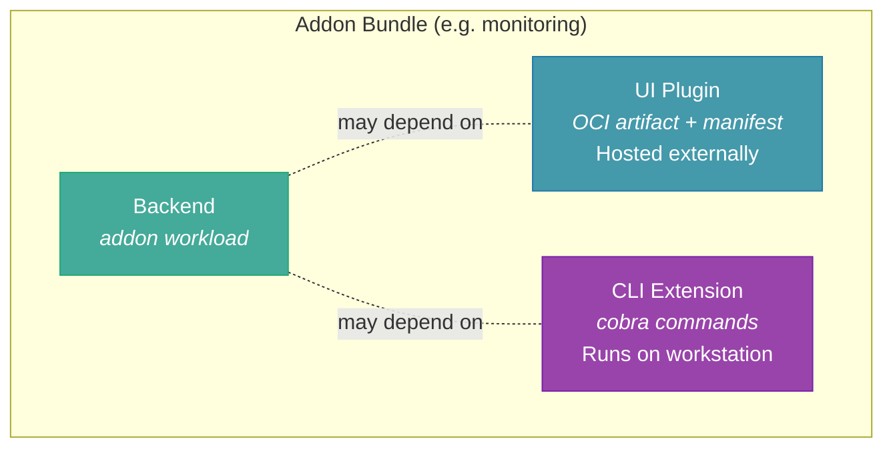

At least one capability is required. UI and CLI capabilities activate when
their declared dependencies are satisfied — they do not inherently require
a backend capability in the same addon.

| Component | What it is | Where it runs | When it activates |
|-----------|-----------|---------------|-------------------|
| **Backend** | Addon workload (any process) | Cluster, sidecar, or standalone | At Connect — when workload provides runtime assets |
| **UI** | Scalprum plugin (OCI artifact: JS bundle + manifest) | Browser (assets hosted externally) | At Enable — when declared dependencies are satisfied |
| **CLI** | CLI extension commands | Developer workstation | At Enable — when declared dependencies are satisfied |

**Key constraint**: An addon must declare its backend dependencies. It does
not have to ship its own backend, but it must specify which backends it
depends on — whether core APIs, other addons, or both. This is declared in
the addon manifest as a dependency list:

```yaml
name: my-custom-dashboard
dependencies:
  - core                    # depends on core platform APIs
  - addon-monitoring        # depends on the monitoring addon's backend
```

The platform validates these dependencies at enable time:

- If all dependencies are available → addon installs normally
- If a dependency is missing → installation is blocked with a clear error
  (e.g. "Requires addon-monitoring which is not installed")

This enables UI-only addons (a custom dashboard that consumes existing APIs)
while ensuring every addon has a functioning data source. An addon with zero
dependencies is valid only for fully static content.

## Addon Catalog

The addon catalog is a **runtime data structure** — not something compiled
into the binary. It is the engine's authoritative registry of what addons
are available, what each addon ships, and how to enable it. The engine reads
the catalog at runtime; adding a new addon means registering it in the
catalog via API, not rebuilding the server.

The catalog builds on the addon lifecycle described in
[addon_integration.md](architecture/addon_integration.md#addon-lifecycle).
An addon in the catalog is in the **Defined** state — the descriptor has
been loaded but no authorization or trust configuration exists. Enabling
the addon transitions it to **Enabled**, which activates capabilities
that don't require workload interaction (e.g. UI plugins). Capabilities
that need runtime assets (managed resource schemas, delivery agents)
become active at **Connect**.

### What the catalog contains

Each entry in the catalog is an `AddonDescriptor` extended with
distribution metadata. The core fields come from the descriptor; the
catalog adds versioning and asset location:

| Field | Description |
|-------|-------------|
| `id` | Unique addon identifier (maps to `AddonDescriptor.ID`) |
| `name` | Human-readable name (maps to `AddonDescriptor.Name`) |
| `version` | Semver — used for upgrades and cache-busting |
| `capabilities` | Declared capability types (maps to `AddonDescriptor.Capabilities`) |
| `install_spec` | OCI artifact reference for the backend workload (e.g. `ghcr.io/org/addon-monitoring:v1.2.0`), if backend capabilities present |
| `manifest_url` | URL to the `plugin-manifest.json` on the external asset host, if UI plugin capability present |
| `assets_base_url` | Base URL where JS/CSS assets are hosted (e.g. `https://cdn.example.com/addons/monitoring/v1.2.0`), if UI plugin capability present |
| `extends_core` | Which core plugin surface this addon extends (if any) |
| `dependencies` | Other addons or core APIs this addon requires |

The engine does **not** store or serve addon UI assets. The catalog stores
metadata and URLs — pointers to where the assets live. The `install_spec`
tells the engine how to deploy the backend workload. The `manifest_url` and
`assets_base_url` tell the shell where to fetch the UI plugin. Asset hosting
is a deployment concern: a CDN, an nginx server, S3, or any static file
host. See [OCI Artifact Distribution](#oci-artifact-distribution) for the
packaging and deployment model.

### Per-instance catalogs

Each OME deployment has its own addon catalog. A self-hosted OME might have
a private catalog populated with internal addons. A hosted/SaaS OME could
optionally point to a public catalog as well. This is analogous to Helm's
configurable chart repositories or VS Code's extension marketplace — the
catalog source is a deployment decision, not a build decision.

### Catalog vs. enabled vs. connected

The catalog, enablement, and connection are separate concerns that map to
the addon lifecycle phases:

- **Defined** (in catalog) = "this addon is available" — the descriptor
  and distribution metadata are registered, but nothing is authorized or
  active. Like a Helm chart in a repo you haven't installed.
- **Enabled** = "this addon is authorized and its non-workload capabilities
  are active" — UI plugins are discoverable by the shell, dependencies are
  validated. No backend workload is running yet.
- **Connected** = "a workload has provided runtime assets" — managed
  resource schemas are compiled, delivery agents are routed, targets are
  seeded. Only relevant for addons with backend capabilities.

Disabling an addon removes its runtime state (API surfaces, delivery
agents, UI plugin entries) but does not remove it from the catalog — it
returns to Defined and remains available for re-enablement.

### Runtime registration — not baked into the binary

The production model is that the engine does **not** need to know about
addons at build time. Bundling the universe of addons into the binary would
require bespoke builds for different product configurations and would
prevent users from shipping their own addons without a custom build.

Instead, addons are registered at runtime via API (or CLI, which calls the
API). The catalog is just data in the engine's database. This means:

1. **Adding an addon** = an API call that creates a catalog entry (Defined)
2. **Different deployments** can have completely different catalogs
3. **Third-party addons** work without any changes to the engine binary

> **Current POC:** Addon descriptors are compiled into the server binary
> (e.g. `kindaddon.Descriptor()` with `go:embed` for proto sources).
> Enable and Connect happen at startup. This is an interim model — the
> lifecycle framework is designed for runtime registration.

## The Core Insight

The engine already knows the full universe of available addons before any
cluster installs anything. A cluster cannot install an addon the engine does
not offer. This means:

1. **The engine knows every addon at registration time.** When an addon is
   registered via the API, the engine stores its metadata — backend install
   spec, UI manifest URL, asset base URL, dependencies. The engine does not
   store UI assets; it stores pointers to where they are hosted.
2. **Clusters only toggle state.** Installing an addon on a cluster is a
   state change ("cluster X has addon Y enabled"), not a data transfer.
3. **No asset upload from fleetlets is necessary.** The push-to-platform
   model (fleetlets uploading JS bundles over gRPC) adds complexity without
   value. Assets are hosted externally and loaded directly by the browser.

## Architecture

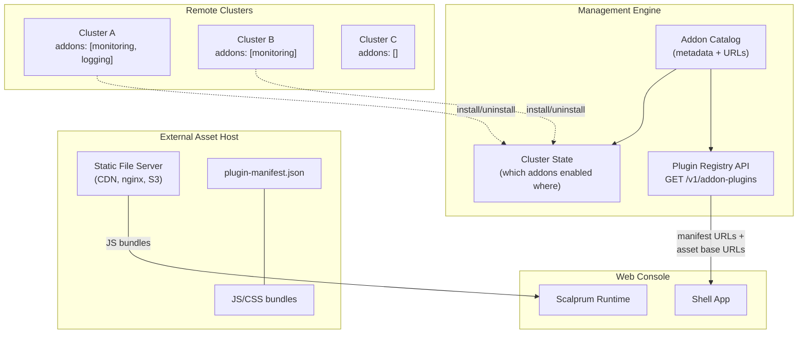

## Lifecycle

The UI plugin lifecycle is part of the unified addon lifecycle, not a
separate flow. The phases below show what happens for an addon that
declares a UI plugin capability — possibly alongside backend capabilities.

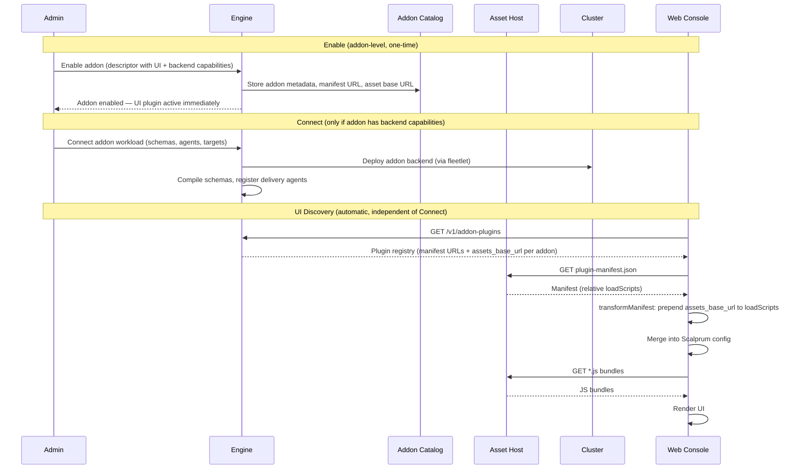

For a frontend-only addon, the Connect phase is skipped entirely — Enable
is sufficient. For an addon with both UI and backend capabilities, the UI
plugin is active at Enable while the backend capabilities activate at
Connect. See [addon_integration.md](architecture/addon_integration.md#addon-lifecycle)
for the full lifecycle.

## What the Engine Stores

The engine stores **metadata only** — no JS bytes, no asset blobs. The
catalog fields are described in [What the catalog contains](#what-the-catalog-contains).
The engine does not read or modify the manifest. It provides the
`assets_base_url` alongside each addon entry in the plugin registry
response. The shell's Scalprum `transformManifest` callback prepends
the base URL to each relative `loadScripts` entry at runtime, resolving
them to absolute URLs before loading.

## What the Cluster Controls

A cluster's relationship to addons is purely declarative state:

```
Cluster A:
  installed_addons:
    - monitoring (v1.2.0)
    - logging (v1.0.0)
```

The cluster does not hold or transmit UI assets. It runs the addon workload
and reports health/metrics via the fleetlet. The UI surfaces are entirely
server-side in the engine.

## Why Not Push-from-Fleetlet?

An alternative model has each fleetlet discover addon UI assets from a shared
volume and upload them to the engine over gRPC. This was considered and
rejected:

| Concern | Push Model | Decoupled Model |
|---------|-----------|-----------------|
| Asset availability | Only after a cluster connects | Always available (hosted externally) |
| Duplicate uploads | N clusters with same addon = N uploads | Zero uploads |
| Offline clusters | No UI until cluster reconnects | UI always works |
| Version consistency | Race between fleetlets uploading different versions | Single source of truth (OCI tag) |
| Bandwidth | Large JS bundles over gRPC on every reconnect | Zero network cost to engine |
| Complexity | Fleetlet needs asset discovery + upload logic | Assets served by static file host |

The push model solves a problem that does not exist: addons cannot appear on
clusters that the engine does not know about.

## Shell Integration

The shell (web console) discovers addon plugins the same way it discovers
built-in plugins. The only difference is where the assets are hosted — the
shell does not know or care.

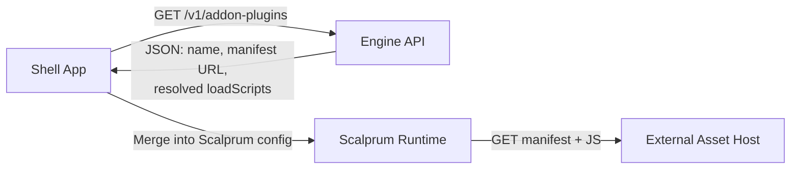

The Scalprum config for an addon plugin looks identical to a built-in plugin.
The `manifestLocation` and `assetsHost` point to the external asset host,
not the engine:

```json
{
  "addon-monitoring-plugin": {
    "name": "addon-monitoring-plugin",
    "manifestLocation": "https://cdn.example.com/addons/monitoring/v1.2.0/plugin-manifest.json",
    "assetsHost": "https://cdn.example.com/addons/monitoring/v1.2.0"
  }
}
```

The shell does not know or care whether a plugin is built-in or an addon,
or whether assets are served from the same origin or a CDN. Scalprum loads
them all the same way.

## OCI Artifact Distribution

Addon UI plugins are packaged as **OCI artifacts** — minimal container images
that contain only the compiled frontend assets. This leverages the OCI
distribution spec to treat web modules as versioned, immutable packages
that can be hosted anywhere.

### The artifact format

Each addon UI plugin builds into a `FROM scratch` container image:

```dockerfile
FROM scratch
COPY dist/ /dist/
```

The `/dist` directory contains everything the browser needs:

```
/dist/
├── plugin-manifest.json    # Scalprum manifest (extensions, loadScripts)
├── plugin-entry.js         # Federated module entry point
├── 123.js                  # Code-split chunks
└── styles.css              # Optional stylesheets
```

### Location-agnostic builds

The build toolchain must produce artifacts that work on **any host and
domain** without rebuilding. This requires two things working together:

1. **Webpack `publicPath: "auto"`** — the bundler does not hardcode any
   domain or path prefix into the compiled chunks. At runtime, chunks
   resolve their URLs relative to the script that loaded them.

2. **`@openshift/dynamic-plugin-sdk-webpack`** — the SDK produces the
   `plugin-manifest.json` with relative `loadScripts` entries (e.g.
   `"plugin-entry.js"`, not `"https://cdn.example.com/.../plugin-entry.js"`).

This combination is what makes the same OCI artifact deployable to any
host — a CDN, an internal nginx, S3, GitHub Pages — without rebuilding.
The domain is never baked into the artifact at build time.

### Publishing and deployment

The OCI artifact lifecycle is separate from the engine:

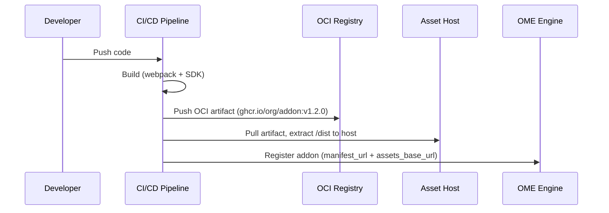

1. **Build**: CI runs webpack with the Dynamic Plugin SDK. Output goes into
   a `FROM scratch` image with `/dist`.
2. **Publish**: Push to any OCI-compliant registry (ghcr.io, quay.io, ECR,
   private registry).
3. **Deploy**: Pull the artifact and extract `/dist` to a static file host.
   This is an ops pipeline step — `docker create` + `docker cp` or
   equivalent. The engine is not involved.
4. **Register**: An API call (or CLI command) tells the engine where the
   assets landed: the `manifest_url` and `assets_base_url`.

The engine never touches the JS bytes. It stores the URLs and serves them
to the shell as part of the plugin registry response.

### Manifest resolution (client-side)

The `plugin-manifest.json` in the OCI artifact uses relative paths:

```json
{
  "name": "addon-monitoring-plugin",
  "extensions": [...],
  "loadScripts": ["plugin-entry.js"]
}
```

At registration time, the engine stores the `assets_base_url` alongside
the manifest URL. The manifest itself is never mutated — it stays on the
asset host with its original relative paths.

When the shell fetches the manifest, Scalprum's `transformManifest`
callback prepends the `assets_base_url` to each `loadScripts` entry at
runtime:

```
manifest.loadScripts = ["plugin-entry.js"]
              ↓  transformManifest(manifest, assetsHost)
manifest.loadScripts = ["https://cdn.example.com/addons/monitoring/v1.2.0/plugin-entry.js"]
```

The engine only stores the base URL. The shell does the resolution. The
same OCI artifact can be deployed to different hosts in different
environments — only the registered `assets_base_url` changes.

### Versioning and rollback

OCI tags provide immutable versioning for free:

- `ghcr.io/org/addon-monitoring:v1.2.0` — specific release
- `ghcr.io/org/addon-monitoring:v1.1.0` — previous version, still in registry

Old versions remain on the asset host (or can be re-extracted). Rolling
back is updating the catalog entry's `assets_base_url` to point to the
previous version's directory — no rebuild, no redeployment of the artifact.

### Environment portability

The same OCI artifact works across all environments:

| Environment | Asset Host | `assets_base_url` |
|-------------|-----------|-------------------|
| Dev (local) | `localhost:8001` | `http://localhost:8001/addons/monitoring/v1.2.0` |
| Staging | Internal nginx | `https://assets.staging.internal/addons/monitoring/v1.2.0` |
| Production | CDN | `https://cdn.example.com/addons/monitoring/v1.2.0` |

The artifact is built once. Where it is hosted and how it is registered
are deployment decisions, not build decisions.

## Addon Visibility Rules

An addon's UI plugin appears in the console when:

1. The addon is **enabled** in the engine (not just defined in the catalog)
2. The addon's **declared dependencies** are satisfied (all required
   capabilities — core APIs or other addons — are available)
3. The user has the addon's nav items enabled in their preferences

Rule 2 is the critical gate. If an addon ships its own backend, those
backend capabilities must be connected. If an addon depends on other
addons' capabilities, those addons must be enabled (and connected, if
they have backend capabilities). If an addon only depends on core APIs,
it activates as soon as it is enabled (core is always available).

The same rule applies to CLI extensions: an addon's CLI commands are only
relevant when its dependencies are satisfied.

Rule 3 gives users per-persona control via the existing marketplace toggle
mechanism.

## Extension Model

A single addon UI plugin can expose **multiple components** -- both standalone
pages and extensions to core extension points. This means one addon bundle
can contribute several surfaces to the console at once.

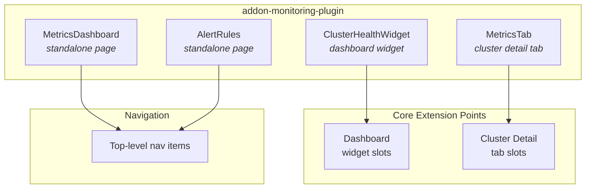

Extension types:

- **`fleetshift.module`** -- standalone page with its own nav item
- **`fleetshift.dashboard-widget`** -- widget rendered on the dashboard
- **Core extension points** -- tabs, panels, or other slots defined by core
  plugins (e.g. a tab on the cluster detail page)

Addon plugins **cannot** reference other addon plugins' scopes in their
`$codeRef`. They can only extend core plugin surfaces. This constraint is
enforced at load time: if a `$codeRef` references a non-core scope, it is
rejected.

## Cross-Plugin Navigation

Plugins -- including addons -- need to link to each other without hardcoding
paths. A monitoring addon might link to a cluster detail page owned by the
core plugin, or a core widget might link to an addon's metrics page. Hardcoded
paths create tight coupling and break when routes change or plugins are not
installed.

The solution is **reference-based navigation**: plugins navigate by target
scope and module name, not by path. The shell resolves these references to
actual routes at runtime based on the page registry. If the target plugin is
not installed, the link gracefully degrades.

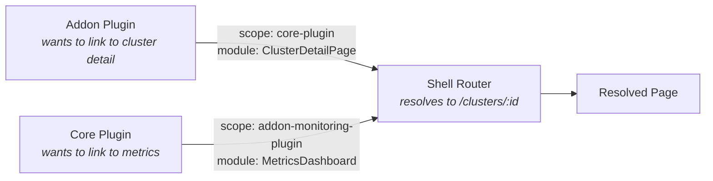

The engine holds the routing structure -- it knows which plugins are
registered, what modules they expose, and which routes they occupy. This
means the backend can provide the page registry that the shell uses for
resolution, keeping routing knowledge centralized rather than scattered across
plugins.

See [007-cross-plugin-navigation](https://github.com/fleetshift/fleetshift-user-interface/blob/main/spikes/007-cross-plugin-navigation.md)
for the implementation spike.

## Explored Alternative: Allowing Core Plugin Overrides

A question was raised about whether addons should be able to replace core
plugin surfaces entirely — for example, shipping a "better Deployments page"
that replaces the core one. This is technically possible but introduces
cascading UX consistency problems. This section explores why.

### The problem: core plugins are extension targets

Core plugins are not standalone pages — they are **extension targets** that
other plugins depend on. Consider the core Deployments plugin in an OCP-like
model:

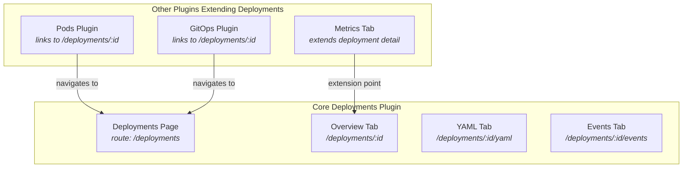

The Deployments page has:

1. **Nested routes** — tabs like Overview, YAML, Events, each with their own
   route segment
2. **Extension points** — slots where other plugins inject tabs (e.g. a
   monitoring addon adds a Metrics tab)
3. **Inbound links** — other plugins (Pods detail, GitOps) navigate to
   specific deployment routes

### What breaks when you override

If an addon replaces the core Deployments plugin:

| Dependency | What breaks |
|-----------|-------------|
| **Nested routes** | Unless the addon re-implements every nested route identically, deep links from other plugins return 404. A link to `/deployments/:id/yaml` fails if the replacement plugin doesn't have that route. |
| **Extension points** | The monitoring addon injects a Metrics tab into the Deployments detail page. If the replacement plugin doesn't implement the same extension point slots, the tab disappears silently. |
| **Cross-plugin navigation** | Pods detail links to "View Deployment" via scope reference to the core Deployments plugin. Core plugins are always present, and scopes must be unique — the addon *must* use a different scope. This means every cross-plugin link that references the core scope still resolves to the core plugin. The addon can never intercept those links without re-registering every other plugin's references. |
| **Route uniqueness** | Routes must be unique. The replacement plugin either takes the same route (breaking the original) or uses a different route (breaking all inbound links). There is no safe middle ground. |

### The alternative: addons on separate routes

An addon *can* create a custom Deployments-like page on its own route (e.g.
`/my-deployments`). Users can enable/disable nav items via the marketplace.
But this does not replace the core plugin — it coexists alongside it:

- Other plugins still link to the core Deployments page
- Extension points still target the core plugin's slots
- The addon's page is isolated — it doesn't receive extensions from other
  plugins unless it explicitly implements the same extension point contract

To make cross-plugin links point to the addon's page instead of the core
one, every other plugin that references the Deployments scope would need to
be updated. This is a platform-wide change, not a local addon decision.

### Conclusion

Overriding core plugins is technically possible but **we cannot guarantee
consistent UX** when it happens. The web of dependencies between plugins —
routes, extension points, cross-plugin navigation — assumes the core plugin
is the canonical owner of its routes and extension slots. Replacing it breaks
that assumption for every other plugin that depends on it.

What addons *can* do:

- **Extend** core plugin surfaces (add tabs, widgets, panels via extension
  points)
- **Create new pages** on their own routes with their own nav items
- **Consume core APIs** without shipping their own backend

What addons *cannot* safely do:

- **Replace** a core plugin's routes (breaks inbound links)
- **Override** a core plugin's extension points (breaks other addons'
  extensions)
- **Shadow** a core plugin (two plugins on the same route is undefined
  behavior)

## Pre-Installed Plugins

Not every UI surface requires an addon backend. Products that ship with
OpenShift or are installed independently (ACS/StackRox, Service Mesh,
Serverless, etc.) install CRDs and expose data through the standard
Kubernetes API. Their UI plugins can communicate with the cluster
directly — the same way the classic OpenShift console plugin model works.

These **pre-installed plugins** sit between core plugins and full addons:

| Type | Backend dependency | Data path | Example |
|------|-------------------|-----------|---------|
| **Core plugin** | None (core K8s APIs) | fleetlet → K8s API | Pods, Namespaces, Nodes |
| **Pre-installed plugin** | None (pre-existing CRDs) | fleetlet → K8s API (custom resources) | ACS, Service Mesh, Serverless |
| **Addon plugin** | Addon backend (deployed by OME) | fleetlet → addon sidecar → OME | Custom monitoring, custom dashboards |

### From the UI, all plugins are the same

The distinction between these three types exists only on the **backend
lifecycle** side — who deploys and manages the data source. From the UI
and CLI perspective, installation is identical for all plugin types:

1. The plugin manifest (entry point, exposed modules, extensions) is
   registered in the catalog
2. The federated module is enabled
3. Scalprum loads and renders it

The federated module itself knows how to obtain its data. It makes HTTP
calls to whatever API it needs — core K8s, OpenShift CRDs, or an addon
aggregation endpoint. The shell does not know or care where the data comes
from. This means there is no separate "install" vs "import" flow for the UI
layer. Whether the backend was deployed by OME, pre-installed by an
operator, or is a built-in K8s API, the UI plugin activation is the same
operation: register metadata, enable the module.

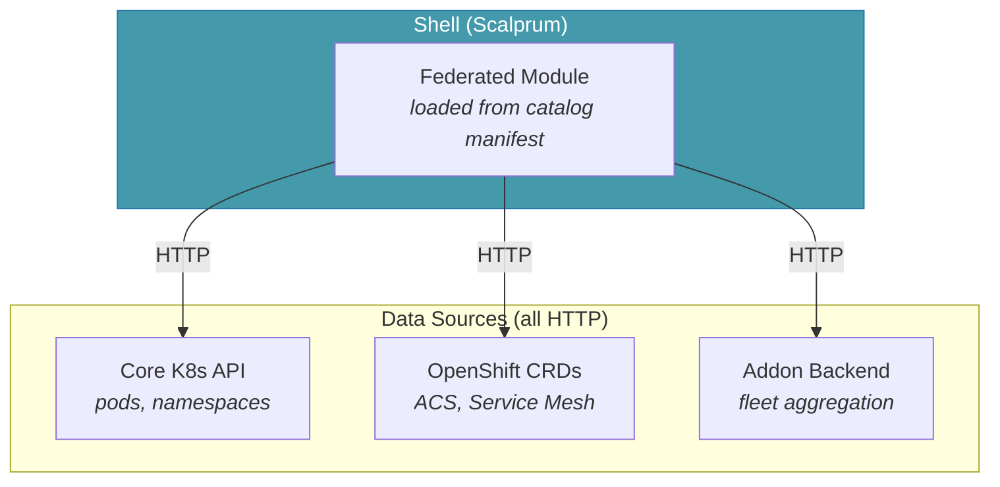

The module may need configuration (e.g. which cluster to query, which
aggregation endpoint to use), but this is runtime context passed via the
shell's API object — not a difference in the plugin loading mechanism.

### Discovery and activation

A core plugin is always available (every cluster has pods and namespaces).
A pre-installed plugin only makes sense when the relevant CRDs are present
on the cluster. Unlike addon plugins — where OME deploys the backend and
knows exactly what exists — pre-installed plugins are set up by operators
or product installers. OME needs to **discover** them.

The catalog drives this. Each pre-installed plugin entry declares what to
look for:

```yaml
name: acs-plugin
type: pre-installed
discovery:
  crds:
    - stackrox.io/v1alpha1/CentralInstance
    - platform.stackrox.io/v1alpha1/SecuredCluster
```

The `type: pre-installed` flag tells the system this is not an addon to deploy
but a pre-existing capability to discover. The fleetlet checks whether
the declared CRDs exist on each managed cluster and reports back to OME:

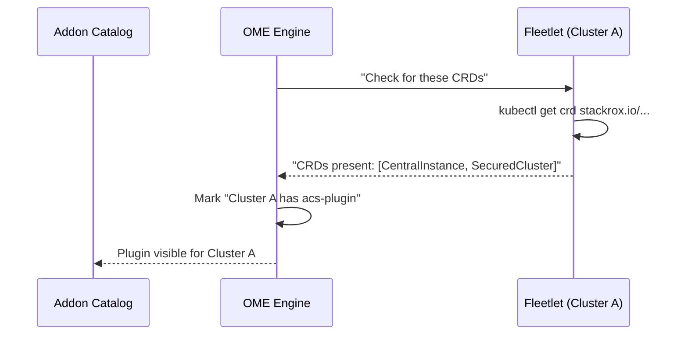

This is the same end state as addon installation — OME knows which
clusters have which plugins — but the path is discovery rather than
deployment. The UI plugin activates when at least one cluster reports the
relevant CRDs, and is hidden when none do.

### The fleet aggregation boundary

The single-cluster view works without any addon backend — the UI can query
one cluster's K8s API for its ACS violations, Service Mesh configs, etc.,
just like the classic OCP console does.

However, once OME manages multiple clusters with the same pre-installed plugin,
a new need emerges: **fleet-wide aggregation**. Viewing all ACS violations
across 50 clusters, comparing Service Mesh configurations across
environments, or rolling out a policy change fleet-wide — these operations
cannot be served by querying one cluster at a time.

This is the point where a pre-installed plugin may evolve into a full addon:

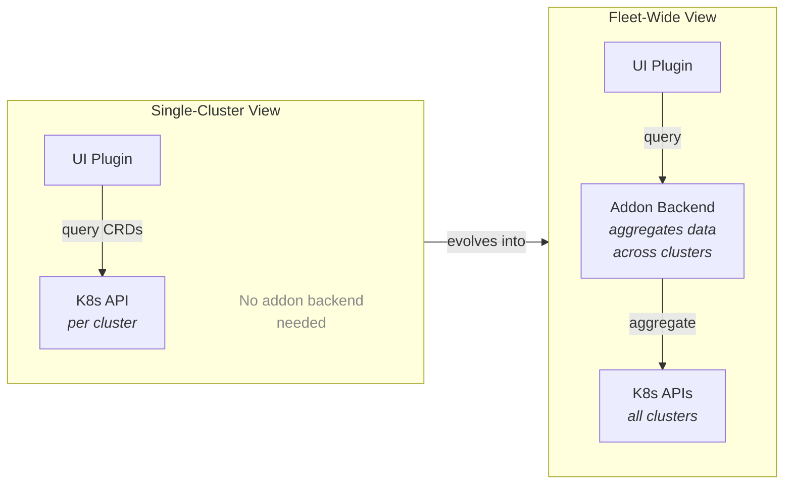

The transition is incremental: the per-cluster UI remains useful on its own,
and the addon backend adds the fleet-wide layer on top. This means a product
like ACS can integrate with OME in two phases:

1. **Day 1**: Register as a pre-installed plugin — per-cluster views work
   immediately for any cluster that has ACS installed, no addon deployment
   required
2. **Day 2**: Ship an addon backend that aggregates ACS data across the
   fleet — fleet-wide dashboards, cross-cluster policy views, etc.

This avoids an all-or-nothing integration model: products get useful
single-cluster UI integration immediately, and invest in fleet-wide
aggregation when the use case demands it.

## Future: Addon SDK

The long-term vision is an addon SDK that bundles backend + frontend + cli:

```
fleetshift addon create monitoring
fleetshift addon build          # produces backend binary + UI OCI artifact
fleetshift addon publish        # pushes OCI artifact to registry + registers with engine
```

The `publish` step pushes the UI artifact to an OCI registry, deploys the
assets to the configured asset host, and registers the addon metadata
(manifest URL, asset base URL, install spec) with the engine. The engine
never stores or serves JS — it stores pointers.

## Consistency with Prior Design Decisions

The engine-centric catalog model is not a new direction -- it follows
directly from decisions already made across the platform's architecture.
This section traces how existing designs lead to this conclusion.

### Addon registration is platform-side (architecture.md, Section 8)

The capability and addon contract establishes that addons register their
capabilities (ManifestGenerator, PlacementStrategy, etc.) with the platform.
The platform is the registry; addons declare what they can do, the platform
routes to them. UI plugin registration is the same pattern applied to
frontend assets.

### The platform owns the plugin registry (architecture.md, Section 12c)

The UI extensibility model explicitly follows the Grafana/OpenShift dynamic
console plugin pattern:

> The platform provides the shell and plugin registry; addons provide
> domain-specific content.

The plugin registry lives on the platform. Addons contribute content to it.
Storing plugin metadata and asset URLs in this registry is the natural
implementation of this design — the platform is the registry, not the
file server.

### Managed resources register schemas with the platform (managed_resources.md)

When an addon connects, it registers its managed resource types as part of
capability registration. The addon declares a `ManagedResourceCapability` at
enable time and provides the full `ManagedResourceSchema` (inline proto
source, spec message name, fulfillment relation) at connect time. The platform
compiles the schema, builds dynamic gRPC/HTTP services, and exposes
consumer-facing APIs. UI plugin metadata follows the same pattern — it is
another capability type in the same addon descriptor, activated at Enable
rather than Connect. See
[addon_integration.md](architecture/addon_integration.md#addon-lifecycle)
for the unified addon lifecycle.

### Addon discovery flows from the platform (OME-12)

The foundational addon story (OME-12: Addon registration and discovery)
specifies:

> Addons can be registered with the platform and declare their capabilities.
> The platform can discover available addons and route to them based on type.

Registration is with the platform. Discovery flows from the platform. This
applies equally to backend capabilities and frontend plugins.

### UI plugin discovery is based on backend registration (OME-13)

OME-13 (Web UI addon integration) specifies:

> UI plugins are discoverable based on backend addon registration. The addon
> model provides the metadata the frontend needs to load the correct plugin.

The frontend asks the platform what plugins exist. The platform answers based
on what addons have registered, providing the URLs where assets are hosted.

### The kernel owns the UI shell (OME-30 layered model)

The cluster provisioning design (OME-30) defines a four-layer architecture.
The UI shell and plugin system sit at Layer 1 (kernel) -- platform
infrastructure that addons at higher layers contribute to. The kernel
manages the plugin catalog; addons populate it.

### All addon stories follow the same pattern (OME-18 through OME-21)

MCOA, ACS, manifest strategies, and API extensions all register with the
management plane. The management plane stores their definitions and routes
to them. No addon story has the cluster as the source of truth for addon
capabilities or assets.

## Relationship to Existing Implementation

The addon lifecycle is partially implemented. The `AddonManager` supports
the three-phase lifecycle (Defined → Enabled → Connected) with
`AddonDescriptor` for capability declaration and `ManagedResourceSchema`
for runtime schema registration. The implemented capability types are
`ManagedResourceCapability` and `DeliveryCapability`. Managed resource API
extensibility — dynamic gRPC services via `DynamicServiceMux` and HTTP
routes via `DynamicHTTPMux` — is implemented and tested, including atomic
schema replacement with content hashing. See
[addon_integration.md](architecture/addon_integration.md#addon-lifecycle)
for the lifecycle and
[managed_resources.md](managed_resources.md#api-grpc--rest) for the
dynamic API surface.

A UI plugin capability type has not yet been implemented, but the framework
is designed to support it — it would be another capability variant in the
descriptor, activated at Enable time (no Connect needed). The current
codebase has proto definitions (`UIPluginSpec`, `RegisterPlugin`) that will
evolve to store metadata and URLs rather than asset blobs. The plugin
registry API (`/v1/addon-plugins`) and the Scalprum config merge logic in
the shell remain the correct integration points — the change is in what
the engine stores (metadata + URLs) and where assets are served from
(external host, not engine).

The fleetlet-side asset discovery code is unnecessary under this model
and should not be used in production. Assets flow from OCI registry →
asset host → browser, never through the engine or fleetlets.
