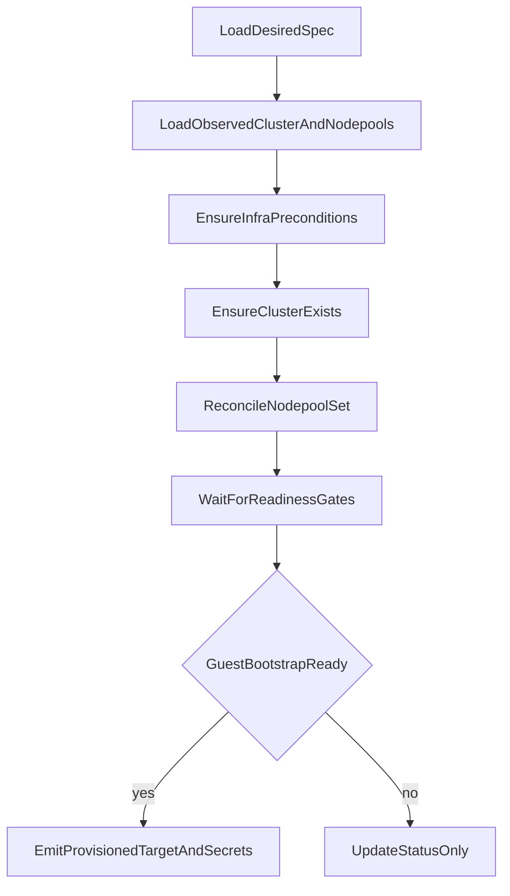

# GCP HCP Hosted Cluster Addon V1 Design

**Purpose:** Architectural design for a minimal v1 `gcphcp` FleetShift addon.

This document describes the intentionally simplified first implementation, not the full long-term
shape of the addon.

It emphasizes the smallest useful end-to-end model that fits FleetShift's current reconciliation
and workflow behavior, even when that means deliberately leaving out capabilities that a later
version should add.

For the explicit list of intentional omissions and deferred capabilities, see
[`14. Intentionally Left Out Of V1`](#14-intentionally-left-out-of-v1).

The design centers on a **managed-resource front door** backed by **self-targeted delivery**:

- the user-facing object is a managed resource such as `api.gcphcp.cluster`
- the addon seeds targets from config, one per GCP project + region
- the managed resource derives to a target through `RegisteredSelfTarget`
- the delivery agent executes provisioning and teardown against the external HCP control plane

---

## 1. Architectural Context

The relevant FleetShift addon shapes are:

### 1.1 Managed-resource + delivery hybrid

Kind illustrates a managed-resource plus delivery hybrid:

- declares `DeliveryCapability`
- declares `ManagedResourceCapability`
- connects with a delivery agent
- connects with a managed-resource schema
- seeds a self target
- derives managed resources to that self target through `RegisteredSelfTarget`

This is the strongest model for a real cluster-management addon.

### 1.2 Dynamic addon-owned APIs

Managed-resource schemas compile into dynamic runtime APIs:

- dynamic gRPC service
- dynamic HTTP routes
- dynamic reflection descriptors

So a `gcphcp` addon does **not** need core protobuf changes to expose its own cluster resource.

---

## 2. PoC Scope And Role

The GCP HCP material in the repo is a standalone Python workflow under `poc/gcp-hcp/`.

It is source material for addon design, not an addon implementation. It is not itself:

- a `DeliveryAgent`
- a FleetShift managed resource
- an async `Deliver() -> Accepted -> signaler.Done()` addon flow
- a `ProvisionedTarget` registration flow

The relevant operator-run scripts and helpers are:

- `hcp_lifecycle.py`
- `hcp_oc_login.py`
- `hcp_status_dump.py`
- `lib/hypershift.py`
- `lib/crypto.py`

This document uses the PoC to identify the management-plane auth flow, lifecycle sequencing,
resource model, and bootstrap gaps that the addon design must account for.

---

## 3. Repo-Backed PoC Facts

### 3.1 Management-plane auth flow

The management-plane auth chain is:

```text
browser OIDC login
  -> OIDC token set
  -> Google Workforce STS exchange
  -> IAM Credentials generateIdToken() for broker service account
  -> Google-signed broker ID token
  -> CLS gateway / backend
```

Each CLS request sends:

- `Authorization: Bearer <broker-id-token>`
- `X-User-Email: <broker-sa-email>`

The broker SA email is used as `X-User-Email` because the CLS backend and guest-cluster Kubernetes
auth both require a Google-signed JWT. The caller's federated OIDC token cannot be used directly
(see section 14.4). As a result, the CLS backend treats the broker SA as the cluster owner and
grants it `cluster-admin` inside the guest cluster.

Additional auth clarifications:

- tenant bootstrap and teardown via `hypershift` do not use the broker service account
- the current implementation writes the raw caller token into a temporary
  `external_account` ADC workspace and lets Google ADC perform Workforce STS exchange inside the
  `hypershift` subprocess
- direct addon-owned GCP API calls that do not go through `hypershift` (for example delete-time
  PSC cleanup waiting) can use the already-minted Workforce access token directly
- authorization for tenant bootstrap is based on a role-derived Workforce `principalSet`, not
  per-email IAM bindings

### 3.2 `oidc_issuer_url` is only for management-plane login

In the PoC, `oidc_issuer_url` is used for browser login and Workforce STS setup.

It is **not** passed through as hosted-cluster human-auth configuration.

So the PoC does not establish end-to-end external human OIDC wiring for the guest cluster.

### 3.8 Credential file handling

The PoC writes three auth-related files to disk during each lifecycle operation: a Workforce STS
subject token, an external-account credential config, and a generated JWKS file (create only).

All three are created inside a temporary directory with guaranteed cleanup even on unhandled
exceptions. The PoC also creates an isolated environment root to prevent `gcloud` and `hypershift`
from falling back to ambient ADC.

Files are required because the PoC shells out to both `gcloud` and `hypershift` CLIs, which only
accept file paths. The addon eliminates `gcloud` entirely (see section 8.4) and only invokes
`hypershift` as an external binary, so file creation is limited to what `hypershift` requires.

### 3.4 Create flow

Today the create flow is:

```text
authenticate
  -> generate 4096-bit RSA keypair + JWKS
  -> hypershift create iam gcp
  -> hypershift create infra gcp
  -> create or update cluster via CLS
  -> reconcile desired nodepool set
  -> poll cluster phase until Ready
  -> bootstrap guest registration with broker ID token
  -> wait for desired nodepools to become healthy
```

Important facts:

- `hypershift` is invoked locally
- `hypershift` is currently pointed at a temp `external_account` ADC workspace whose subject token
  is the raw caller token
- bootstrap must not fall back to ambient ADC from the workstation, pod, or node environment
- the managed-resource spec can carry one or more desired nodepools, and the reconciler updates the
  backend set by nodepool name
- create success is gated on cluster phase, guest bootstrap/registration, and explicit desired
  nodepool readiness

### 3.5 Delete flow

Today the delete flow is:

```text
authenticate
  -> resolve cluster ID
  -> DELETE /api/v1/clusters/{id}?force=true
  -> poll until 404
  -> wait for PSC endpoint artifacts to disappear
  -> hypershift destroy infra gcp
  -> hypershift destroy iam gcp
```

Important facts:

- delete is multi-stage
- PSC cleanup keys off the backend cluster ID
- infra destroy keys off the infra ID / cluster name
- IAM cleanup failure is treated as a delete failure after infra cleanup succeeds
- delete auth is currently split three ways:
  - broker token for CLS requests
  - minted Workforce access token for direct PSC cleanup calls
  - a temp `external_account` ADC workspace built from the raw caller token for `hypershift`
    teardown

### 3.6 Guest-cluster login uses the broker token

`hcp_oc_login.py` proves that the broker ID token is accepted by the guest cluster's Kubernetes API
server:

```text
authenticate (same broker token flow as lifecycle)
  -> resolve guest API endpoint from CLS backend status
  -> validate broker ID token against guest cluster API
  -> oc login with broker ID token
```

Important meaning:

- guest login uses the same broker ID token as CLS backend requests
- the identity inside the guest cluster is the broker SA email
- the CLS backend grants the broker SA `cluster-admin` at cluster creation, which is why the token
  is accepted
- this proves the addon can bootstrap delivery credentials inside the guest cluster using the
  broker token (see section 10.4)

### 3.7 Status inspection is richer than readiness gating

`hcp_status_dump.py` collects:

- cluster details
- cluster status
- nodepool list
- per-nodepool status

The repo material already shows a useful distinction:

- the create script gates on cluster phase only
- captured status examples show `cluster.status.phase == Ready` while a desired nodepool still
  reports `status.phase == Progressing` with `Ready=False`
- later captured status shows the cluster still `Ready` only after the nodepool eventually reaches
  its own ready / healthy state
- the status dump therefore shows a richer multi-object lifecycle view than top-level cluster phase
  alone

That distinction should influence the addon design's readiness model.

---

## 4. Recommended Architectural Shape

The recommended `gcphcp` shape is:

1. **managed-resource front door**
2. **seeded self target underneath**
3. **delivery agent as the provisioning executor**

In concrete terms:

- addon ID: `gcphcp`
- delivery target type: `gcphcp`
- managed resource type: `api.gcphcp.cluster`
- seeded targets: one per configured GCP project + region (e.g. `gcphcp-example-region-staging`)
- relation: `RegisteredSelfTarget` routing to the configured targets

### Why this is the right shape

Because a managed resource gives FleetShift a durable, user-facing cluster object even when the
guest cluster is not yet safe to register as a normal `kubernetes` delivery target.

That is exactly the shape hosted control plane provisioning needs.

---

## 5. Recommended Addon Shape

### 5.1 Descriptor

The addon should declare both capabilities:

```text
DeliveryCapability{TargetType: "gcphcp"}
ManagedResourceCapability{ResourceType: "api.gcphcp.cluster"}
```

### 5.2 Connect-time assets

At connect time, the addon should provide:

- the delivery agent
- one `TargetInfo` per entry in the config file's `targets:` list, with `gcp_project`, `region`,
  and identity federation fields stored in `TargetInfo.Properties`
- the managed-resource schema for `api.gcphcp.cluster`

### 5.3 Fulfillment relation

For v1, the relation should be:

```text
RegisteredSelfTarget
```

`RegisteredSelfTarget` derives **static placement to exactly one addon target**.

So v1 should use one active `gcphcp` addon target, with all `api.gcphcp.cluster` managed resources
routing to that target.

Multi-target routing is **not** supported by this relation today. The current platform placement
model does not inspect `TargetInfo.Properties`, and `RegisteredSelfTarget` itself emits static
placement to one target ID. Future multi-target routing therefore requires platform work or a
different fulfillment-relation shape; it should not be presented as an already-supported v1 path.

That means managed resources derive to:

- managed-resource manifest strategy
- static placement to the addon target
- immediate rollout

This is already a first-class repo pattern.

### 5.4 Internal components

A good package split would be:

- `agent.go`
  - `DeliveryAgent` entry points and lifecycle boundary to FleetShift
  - owns `Deliver(...)` and `Remove(...)`, including the platform-facing contract:
    - validate incoming manifests
    - validate or derive caller/auth context
    - decide whether to return `Accepted`, `Failed`, or `AuthFailed`
    - launch long-running provisioning work
    - complete via `signaler.Done(...)`
  - should stay thin and orchestration-oriented rather than containing every provider detail
  - is the right place to coordinate the other subsystems:
    - auth exchange
    - infrastructure preparation
    - management-plane client calls
    - reconciliation
    - readiness polling
    - optional guest bootstrap
  - should own the translation between addon-internal failures and FleetShift delivery results
- `descriptor.go`
  - addon declaration and managed-resource registration surface
  - should define:
    - addon ID and name
    - `DeliveryCapability{TargetType: "gcphcp"}`
    - `ManagedResourceCapability{ResourceType: "api.gcphcp.cluster"}`
  - should expose the managed-resource schema for connect-time activation
  - should bind that schema to `RegisteredSelfTarget` for the single active addon target used in v1
  - keeps the addon's integration contract with FleetShift explicit and localized
- `auth.go`
  - management-plane identity translation boundary
  - should encapsulate both auth outputs proven by the PoC:
    - caller token from `DeliveryAuth.Token`
    - Workforce STS exchange (using target's workforce pool/provider config)
    - broker service account `generateIdToken()` (using target's broker SA) for gateway requests
    - explicit short-lived federated Google credentials for tenant bootstrap and `hypershift`
      teardown
  - should set `X-User-Email` to the broker SA email from target config (v1 constraint; see
    section 14.4 for future per-user identity work)
  - should hide the identity federation mechanics from the rest of the addon
  - should own token refresh or re-mint logic for long-running operations
- `client.go`
  - CLS backend / gateway API boundary
  - should own management-plane HTTP calls such as:
    - create cluster
    - get cluster
    - list clusters
    - create nodepool
    - list nodepools
    - get cluster status
    - get nodepool status
    - delete cluster
  - should centralize request construction, headers, response parsing, and backend error handling
  - should not own tenant-project side effects such as IAM/network creation or cleanup
  - should not own higher-level reconciliation decisions; it should be a transport/client layer
- `cluster_spec.go`
  - addon-facing resource model and validation boundary
  - should define the user-facing `api.gcphcp.cluster` spec shape, not merely mirror the raw CLS
    request body
  - should normalize and validate:
    - cluster name / identity rules
    - endpoint access
    - desired nodepool set
    - release / networking / capacity intent
  - should clearly separate user intent from derived implementation fields such as:
    - `infraID`
    - service-account-signing-key material
    - temporary JWKS handling
    - backend-generated IDs
  - is the right place to define defaulting and invariants before reconciliation begins
- `reconcile.go`
  - desired-vs-actual lifecycle coordinator
  - should decide how the addon moves from requested state to provider state:
    - whether the hosted cluster exists
    - whether the desired nodepool set exists
    - whether any updates are needed
    - whether the cluster is ready enough to advance to later phases
  - should sequence the major steps rather than implement all side effects itself
  - should consume `client.go` and `infra.go` as dependencies, not replace them
  - is the right place to hold the long-term "reconcile, do not recreate" behavior even though the
    PoC demonstrates a clean-slate create/delete flow
- `infra.go`
  - tenant-project infrastructure boundary, separate from the CLS backend client
  - owns IAM and network preparation needed before cluster create
  - owns teardown steps that are not completed by cluster delete alone
  - should consume explicit federated credentials from `auth.go` and point `hypershift` at that
    credential source directly
  - should reject or ignore ambient ADC during tenant bootstrap
  - is the right place to wrap the PoC's `hypershift`-based helpers such as:
    - `create_iam_gcp()`
    - `create_infra_gcp()`
    - `destroy_infra_gcp()`
    - `destroy_iam_gcp()`
    - PSC cleanup waiting
  - returns the infrastructure-derived data needed by cluster creation, such as:
    - `infraID`
    - network name
    - subnet name
    - workload-identity/service-account mapping data
  - keeps tenant-side naming rules, retries, cleanup sequencing, and partial-failure handling out of
    `client.go`
- `status.go`
  - readiness model and polling logic
  - should turn raw backend status surfaces into the addon's lifecycle decisions
  - should own polling loops and status interpretation such as:
    - cluster phase checks
    - nodepool readiness checks
    - timeout and retry policy
    - translation of backend status into addon progress/warning/error messages
  - should capture the distinction between:
    - control plane created
    - nodepools created
    - cluster reachable
    - cluster delivery-ready
  - is the right place to grow beyond the PoC's simple "wait for cluster phase Ready" rule
- `bootstrap.go`
  - guest-cluster bootstrap boundary
  - should remain isolated because guest bootstrap is separate from management-plane provisioning
  - owns:
    - resolving guest API endpoint from CLS backend status
    - authenticating to the guest cluster using the broker ID token
    - creating a delivery ServiceAccount and RBAC inside the guest cluster
    - extracting the ServiceAccount token for `ProvisionedTarget` registration
  - see section 10.4 for the full registration design
- `cluster_output.go`
  - conversion boundary between addon-internal results and FleetShift platform outputs
  - should assemble the data that leaves the addon through `DeliveryResult`, such as:
    - `ProvisionedTarget`
    - `ProducedSecrets`
  - should decide which properties belong on the resulting target and which values belong in the
    vault as produced secrets
  - should keep sensitive or implementation-only data out of target properties
  - should be the single place that enforces the rule:
    - only emit a normal `kubernetes` target when the guest cluster is actually delivery-ready

`infra.go` is intentionally distinct from `client.go`.

- `client.go` should own management-plane API calls such as create cluster, get cluster, create
  nodepool, delete cluster, and poll backend status
- `infra.go` should own tenant-project side effects that live outside that API surface

That split matters because the PoC already shows that hosted-cluster lifecycle is not one API:

- cluster create uses backend HTTP calls
- IAM and network preparation use separate `hypershift` commands
- delete is not complete when the cluster object disappears; tenant PSC artifacts and
  infra resources still need cleanup

This boundary also captures an important identifier distinction from the PoC:

- some cleanup steps key off the backend cluster ID
- other cleanup steps key off the `infraID` / cluster name

Keeping that logic in `infra.go` prevents those provider-specific lifecycle details from leaking
into the reconciler or the CLS API client.

---

## 6. Configuration And Target Model

### 6.1 Config tiers

The PoC's `config.yaml` collapses all configuration into one flat file. The addon design splits it
into four tiers with distinct lifecycles:

| Tier | What | Where it lives | Who sets it |
|------|------|----------------|-------------|
| Caller identity | OIDC token for GCP STS exchange | `DeliveryAuth.Token` from FleetShift | Platform (transparent to addon) |
| Gateway config | HCP backend service endpoint and audience | Addon config file, `gateway:` section | Operator at addon startup |
| Target config | Identity federation, broker SA, GCP project, region | Addon config file, `targets:` list; seeded as `TargetInfo.Properties` | Operator at addon startup |
| Cluster spec | Full cluster shape: name, endpoint access, release version, channel group, nodepools (all required) | Managed resource spec (`api.gcphcp.cluster`) | User at cluster creation |

`oidc_issuer_url` and `oidc_client_id` from the PoC's config disappear entirely. The addon receives
the caller's OIDC token via `DeliveryAuth.Token` and exchanges it directly with GCP Workforce STS.

Only `gateway_url` and `gateway_audience` are addon-level constants — they identify the shared HCP
backend service. Target config is strictly infrastructure wiring: identity federation path
(`workforce_pool`, `workforce_provider`, `broker_sa_email`) and provisioning destination
(`gcp_project`, `region`).

The config may still use a `targets:` list for internal extensibility, even though v1 only routes
through one active target.

### 6.2 Config file

The addon loads a single YAML config file at startup, passed via `--gcphcp-config` flag or
`GCPHCP_CONFIG` env var.

```yaml
# gcphcp.yaml

gateway:
  url: "https://hcp-backend-gateway.example.invalid"
  audience: "<google-client-id>.apps.googleusercontent.com"

targets:
  - id: "gcphcp-example-region-staging"
    gcp_project: "example-hcp-target-project"
    region: "us-central1"
    workforce_pool: "example-workforce-pool"
    workforce_provider: "example-oidc-provider"
    broker_sa_email: "hcp-idtoken-broker@example-hcp-target-project.iam.gserviceaccount.com"
```

Each target is strictly infrastructure wiring — identity federation path (workforce pool, broker
SA) and provisioning destination (GCP project, region). No cluster shape defaults live on the
target.

### 6.3 Cluster spec — all fields required

The addon does not apply any default values. Every field in the cluster spec must be explicitly
provided by the user at creation time. This makes the contract explicit — what you send is what
you get.

**Cluster-level required fields:**

| Field | Description |
|-------|-------------|
| `name` | Cluster name (max 15 chars, lowercase alphanumeric + hyphens) |
| `endpointAccess` | Control plane access mode (e.g. `"PublicAndPrivate"`, `"Private"`) |
| `releaseVersion` | OCP release version (e.g. `"4.22.0"`) |
| `channelGroup` | Release channel (e.g. `"stable"`, `"fast"`, `"candidate"`) |
| `nodepools` | At least one nodepool (see below) |

**Per-nodepool required fields:**

| Field | Description |
|-------|-------------|
| `name` | Nodepool name |
| `replicas` | Replica count (must be > 0) |
| `instanceType` | GCP machine type (e.g. `"n1-standard-4"`) |
| `rootVolumeSize` | Root disk size in GB (must be > 0) |
| `rootVolumeType` | Root disk type (e.g. `"pd-standard"`, `"pd-ssd"`) |
| `autoRepair` | Whether to enable node auto-repair (`true` or `false`) |
| `upgradeType` | Node upgrade strategy (e.g. `"Replace"`, `"InPlace"`) |

Validation is enforced at two layers: proto annotations (`buf.validate`) on the managed resource
API surface, and Go validation in `ParseClusterSpec` for the internal delivery path.

**Example: creating a cluster via fleetctl**

Current `fleetctl` uses the generic managed-resource surface:

- list available reflected resource collections with `fleetctl resource types`
- create a cluster with `fleetctl resource create <plural> --id <id> --spec-file <path-or->`
- for `gcphcp`, the current reflected plural is `GCPHCPClusters`

```bash
fleetctl resource create GCPHCPClusters --id my-cluster --spec-file - <<'EOF'
{
  "name": "my-cluster",
  "endpointAccess": "PublicAndPrivate",
  "releaseVersion": "4.22.0",
  "channelGroup": "stable",
  "nodepools": [
    {
      "name": "my-cluster-nodepool-1",
      "replicas": 2,
      "instanceType": "n1-standard-4",
      "rootVolumeSize": 128,
      "rootVolumeType": "pd-standard",
      "autoRepair": true,
      "upgradeType": "Replace"
    }
  ]
}
EOF
```

### 6.4 Startup sequence

At startup, the addon:

1. parses the config file into a `Config` struct
2. stores the gateway config (shared across all targets)
3. validates that exactly one target entry is active
4. builds a `TargetInfo` for that target, storing all target fields in `TargetInfo.Properties`
5. passes that `TargetInfo` to `AddonManager.Connect()`

At delivery time, the reconciler retrieves target config from `TargetInfo.Properties` and
constructs a broker auth client for that target's identity federation path.

### 6.5 Target model

Each target represents a provisioning destination: identity federation path plus GCP project +
region.

Target IDs should be human-readable and encode scope (e.g. `gcphcp-example-region-staging`), but the
addon keys off `Properties` values, not the ID string.

V1 uses exactly one active target for managed-resource fulfillment.

### 6.6 Target config vs cluster spec boundary

`gcp_project` and `region` live on the target, not in the managed resource spec. The user does not
pick a project or region when creating a cluster. In v1, those values are implicit because every
managed resource routes to the one active addon target, and that target carries the project/region.

All cluster shape fields (`endpointAccess`, `replicas`, `instanceType`, `rootVolume`,
`release_version`, `channel_group`, management config) live in the managed resource spec and are
required at creation time. The target carries no cluster shape configuration.

### 6.7 Target config drift

If an operator changes a target's `gcp_project` or `region` in the config file and restarts the
addon, existing clusters provisioned under the old values will break — the addon will attempt to
reconcile against the wrong project/region.

V1 does not guard against this. Target config drift detection and `RequiresReplacement` conditions
are deferred (see section 14.5).

### 6.8 Cluster naming and idempotency

Cluster names are user-specified in the managed resource spec. The addon uses the name as the
infrastructure identity.

Idempotency comes from the reconciler checking whether a cluster with that name already exists
before creating. An existing cluster is updated rather than failing on create. This aligns with the
guarded-authoritative reconciliation posture described in section 9.3.

---

## 7. Resource Model Recommendation

### 7.1 Use one managed resource type for v1

Start with one cluster resource type:

- `api.gcphcp.cluster`

Nodepools should remain nested in the cluster spec for v1.

This is a better first increment than exposing separate first-class nodepool managed resources
immediately.

### 7.2 Why nested nodepools are the right v1 shape

Even though the backend has separate cluster and nodepool APIs, the PoC behaves like a single
cluster lifecycle with child nodepools:

- one cluster create
- one nodepool create
- one delete flow
- one operator-run lifecycle command

So the first addon resource should describe the desired cluster and its desired nodepool set, then
let the addon reconcile backend objects.

### 7.3 Design the user-facing spec, not the raw transport body

The user-facing managed-resource spec should express desired intent, not the exact raw CLS request
body used by the PoC script.

The addon should derive or hide implementation details such as:

- `infraID`
- local temp JWKS file usage
- `serviceAccountSigningKey`
- workload identity service-account mapping plumbing
- backend-specific generated IDs

### 7.4 Important PoC-derived caveat

The PoC demonstrates one concrete backend shape:

- a single nodepool
- user-specified machine configuration (all fields required)
- generated signing key material on the client side

So the addon should treat those as implementation details, not as the long-term API shape.

---

## 8. Auth And Identity Design

This remains the most GCP-HCP-specific part of the design.

### 8.1 What the addon should consume

The addon should expect:

- caller identity in `DeliveryAuth.Caller`
- raw caller token in `DeliveryAuth.Token`

Unlike Kind, this token is not optional context. It is an active input to the management-plane auth
chain.

### 8.2 Recommended server-side auth sequence

Inside the addon:

```text
DeliveryAuth.Token
  -> Workforce STS exchange
  -> generateIdToken() for broker service account
  -> CLS gateway request with broker token
  -> X-User-Email set to broker SA email from target config
```

### 8.3 Security rules

The addon should:

1. set `X-User-Email` to the broker SA email from target config, not from user input
2. log the auth chain with enough correlation to debug token exchange and backend calls

### 8.4 Credential materialization

The addon must not write credential files to disk unless an external tool requires it.

The PoC writes three auth files to disk (see section 3.8) because it shells out to both `gcloud`
and `hypershift` CLIs. The addon eliminates `gcloud` entirely — Workforce STS exchange,
`generateIdToken()`, and CLS gateway requests are all handled through Google Cloud Go SDK client
libraries using in-memory token sources.

The only external binary the addon invokes is `hypershift`, for IAM and infrastructure
bootstrap/teardown. If `hypershift` requires file-based inputs (e.g., JWKS, credential configs),
the addon must write them to a temporary directory and register cleanup immediately — before any
fallible work — so files are removed even on error or panic. Temp directories must not be reused
across reconcile passes.

Current implementation detail:

- direct management-plane auth stays in memory: `BrokerAuth.Exchange()` mints the Workforce access
  token and broker ID token used for CLS requests
- `hypershift` subprocesses are still driven through a temp `external_account` ADC workspace:
  `subject_token.txt` contains the raw caller token, and `workforce-cred.json` tells Google ADC to
  perform Workforce STS exchange inside the subprocess
- create writes both that ADC material and a temporary JWKS file into the workspace; destroy writes
  only the ADC material
- delete currently uses the minted Workforce access token directly only for PSC cleanup waiting; it
  does **not** reuse that token when materializing the `hypershift` teardown workspace

So the current implementation still performs a second STS exchange in the `hypershift` path. That
is a real implementation detail to document, not an intended long-term credential model.

### 8.5 Token lifetime concern

This matters especially for `gcphcp` because the flow is slow.

The design should assume:

- short-lived broker credentials may need refresh
- long polls and retries may outlive a single caller token
- future pause/resume semantics may be needed

The PoC does not solve this yet. The addon design should say that explicitly.

---

## 9. Delivery Lifecycle Design

### 9.1 Execution model

Even with a managed-resource front door, actual provisioning should follow the platform's
delivery shell:

1. validate manifests/spec
2. validate auth context
3. return `Accepted`
4. do long-running work asynchronously
5. finish with `signaler.Done(...)`

### 9.2 Initial trigger model

For the initial implementation, reconciliation should remain strictly **FleetShift-driven**.

That means:

- a new reconciliation pass starts when FleetShift observes a managed-resource spec change
- FleetShift's existing fulfillment generation / orchestration workflow remains the only trigger
- the addon may do long-running polling within a single accepted delivery
- the addon does **not** ask FleetShift to schedule a follow-up reconcile after completion

Explicitly out of scope for v1:

- addon-driven requeue / invalidation
- backend-status-driven reverse triggers
- periodic resync that is independent of spec changes

This keeps the first implementation aligned with the platform behavior that already exists in the
repo, instead of introducing a new invalidation hook before the base addon flow is proven.

### 9.3 Reconciliation posture

V1 uses a simple **authoritative** reconciler: the addon treats the FleetShift spec as desired
state and reconciles all fields toward it. If the user changes a spec field, the addon sends the
updated value to the CLS backend.

V1 does not classify fields as safe vs blocked. Changing any field (including fields like
`endpointAccess` or `instanceType` that may not be safely mutable in the backend) is passed through
without guardrails. This is acceptable for the POC — field safety classification is deferred to a
later version (see section 14.5).


### 9.4 Recommended reconcile loop

`reconcile.go` should behave as the desired-vs-observed coordinator, not as a grab bag of provider
side effects.

Recommended high-level flow for a **spec-triggered** reconcile pass:



In words, the reconciler should:

1. load the desired cluster and nodepool spec
2. load observed cluster, cluster status, nodepool list, and nodepool statuses
3. ensure tenant infrastructure preconditions are satisfied
4. ensure the cluster exists (create or update)
5. reconcile the nodepool set (create missing, update existing, delete removed)
6. wait for readiness gates
7. emit outputs only if guest delivery-readiness exists

This loop should run when FleetShift starts reconciliation because the managed-resource intent
changed. It should not depend on the addon being able to request another pass later.

### 9.5 Recommended async flow

```text
Deliver()
  -> parse gcphcp cluster spec
  -> exchange caller token into broker token
  -> ensure tenant IAM resources
  -> ensure tenant network resources
  -> create or update hosted cluster
  -> reconcile desired nodepool set
  -> poll management-plane status
  -> if guest bootstrap succeeds and the desired nodepool set becomes ready within the current
     delivery window:
       -> gather guest endpoint / trust / credentials
       -> bootstrap platform delivery access
       -> emit ProvisionedTarget + ProducedSecrets
     else:
       -> fail with explicit "cluster provisioned, registration incomplete" message
  -> signaler.Done(...)
```

In v1, that async flow is still part of a single spec-triggered orchestration pass. If the addon
times out or reaches a terminal result without guest delivery readiness, it should report that
state through the current pass rather than request a second reconcile from the platform. Because v1
has no addon-driven requeue, no periodic resync, and no durable managed-resource status surface for
"provisioned but not registered yet", the preferred behavior is to fail the current delivery
explicitly once the bounded bootstrap / nodepool-readiness window is exhausted. That failure
message should make clear that the hosted cluster reached management-plane readiness and only guest
target registration is incomplete.

### 9.6 Reconcile is the target design, even though the PoC demonstrates create/delete first

The PoC demonstrates a clean-slate create/delete flow, not a reconcile/update flow.

So the addon design should say both of these at once:

- the addon **should** be built as a reconciler
- the PoC material only **demonstrates** create/delete today
- the initial trigger model is still only FleetShift-side spec change detection, not addon-driven
  invalidation

That is more accurate than pretending the PoC already validates reconcile semantics.

### 9.7 Readiness is a multi-gate flow

The addon should treat "cluster ready" as only one gate in a broader registration sequence. In v1
there are **five distinct gates**:

1. **Management-plane ready:** `cluster.status.phase == Ready`
2. **Guest API discoverable/reachable:** the CLS status exposes an `APIServer` URL and the addon can
   successfully connect to that endpoint
3. **Guest bootstrap ready:** the broker token can perform the required bootstrap writes inside the
   guest cluster
4. **Desired nodepool set ready:** every desired nodepool is present and reports `Ready`
5. **Registered target ready:** the addon has all durable output data and can emit
   `ProvisionedTarget` + `ProducedSecret`

Those gates intentionally separate "the hosted cluster finished provisioning" from "FleetShift can
now treat the guest cluster as a normal Kubernetes delivery target."

**Phase 1 — Provision:** Poll `cluster.status.phase` until `Ready`. This only proves
control-plane / management-plane readiness. Captured status examples show that
`cluster.status.phase == Ready` can coexist with a desired nodepool whose own
`status.phase == Progressing`, so this gate is necessary but not sufficient for registration.

**Phase 2 — Bootstrap:** Once cluster phase is `Ready`, resolve the guest API endpoint from the
`APIServer` condition in `controller_status`, then attempt guest bootstrap with the broker ID token.
This phase uses a **retry loop** because several adjacent conditions may lag behind the phase flip:
the API endpoint may not be reachable yet, or the CLS backend's `rbac-setup-job` (which grants the
broker SA `cluster-admin` inside the guest cluster) may not have completed yet. The bootstrap gate
is only satisfied when the addon can complete the real registration prerequisites: connect to the
guest API, create the delivery ServiceAccount and RBAC, and obtain the ServiceAccount token.

**Phase 3 — Desired nodepool readiness:** After guest bootstrap succeeds, poll the desired nodepool
set until every desired nodepool is present and reports `Ready`. This extra gate is required
because top-level cluster readiness does not guarantee that the requested worker/nodepool capacity
has converged yet. If any desired nodepool reports `Failed`, the addon should fail the current
delivery explicitly.

**Phase 4 — Register:** Emit `ProvisionedTarget` + `ProducedSecret` only after bootstrap succeeds,
the desired nodepool set is ready, and the durable output contract is complete. If cluster phase is
`Ready` but bootstrap or nodepool readiness is still pending, the addon should keep retrying within
the current delivery. If that bounded retry window is exhausted, the addon should fail the current
delivery with an explicit message that the hosted cluster is provisioned and management-plane ready,
but guest target registration did not complete. In all cases it should **not** register the guest
cluster until those gates succeed.

The addon therefore needs more than the top-level cluster phase: it needs the **APIServer endpoint
URL** from `controller_status[cls-hypershift-client].conditions[type=APIServer].message` to
bootstrap the guest cluster, and it needs per-nodepool status surfaces to determine whether the
desired worker set has actually converged.

---

## 10. Output Registration Strategy

### 10.1 Managed resource is the stable user-facing object

This is the biggest benefit of adopting the managed-resource plus self-target model.

Even if the addon cannot yet emit a `ProvisionedTarget`, the user still has:

- a typed `gcphcp` cluster resource
- a fulfillment-backed lifecycle
- a durable object for later status and reconciliation

So a provisioning-only MVP remains structurally clean.

### 10.2 When to emit a `ProvisionedTarget`

The addon should emit a `kubernetes` target only after it can prove the guest cluster is actually
delivery-ready, not merely that the hosted cluster reports `Ready`.

In v1, that means all of the following must be true:

- cluster phase is `Ready`
- the guest API endpoint is resolved and actually reachable for bootstrap
- the guest API endpoint is reachable using the host's normal trust store (see section 10.5)
- a platform delivery credential is successfully created and captured
- every desired nodepool is present and reports `Ready`

If any of those are still pending, including desired nodepools that are still progressing after the
top-level cluster has already flipped to `Ready`, the addon should keep retrying within the current
delivery. If they are still not available when that bounded retry window is exhausted, the addon
should fail the current pass with an explicit message that provisioning reached management-plane
ready but guest target registration is incomplete. It should not emit a guest target and it should
not rely on a follow-up reconcile being scheduled automatically.

### 10.3 PoC-proven guest-cluster auth

`hcp_oc_login.py` proves that the broker ID token is accepted by the guest cluster's Kubernetes API
server. The proven flow is:

```text
authenticate (same broker token flow as lifecycle)
  -> resolve guest API endpoint from CLS backend status
  -> present broker ID token to guest cluster API
  -> guest cluster accepts the token
  -> identity inside the guest cluster is the broker SA email
```

The broker SA email (e.g. `hcp-idtoken-broker@<project>.iam.gserviceaccount.com`) is the identity
the guest cluster sees. This is the same Google-signed ID token used for CLS gateway requests,
reused as a Kubernetes bearer token against the guest API server.

Guest API endpoint resolution uses the CLS backend status API:

- primary: scan `controller_status[].conditions[]` for a condition with `type: APIServer` whose
  `message` starts with `https://`
- fallback: read `api_endpoint` from the cluster object

This endpoint is only available after the cluster reaches `Ready` phase and the control plane API
server is operational.

### 10.4 Addon guest-cluster registration design

The addon must perform guest-cluster registration programmatically. The PoC uses `oc login` as a
human convenience tool — the addon replaces that with direct Kubernetes API calls using the Go
client libraries.

Recommended registration sequence after the cluster reaches `Ready`:

```text
resolve guest API endpoint from CLS backend status
  -> retry until the endpoint is actually reachable for guest bootstrap
  -> build a Kubernetes rest.Config with:
       - host: resolved guest API endpoint
       - bearer token: broker ID token
  -> create a delivery ServiceAccount in the guest cluster
  -> create RBAC for that ServiceAccount
  -> request a ServiceAccount token via TokenRequest
  -> emit ProvisionedTarget{type: "kubernetes"} with:
       - endpoint in target properties
       - ServiceAccount token as a ProducedSecret
```

The broker ID token provides initial privileged access. The addon uses that access to create a
ServiceAccount with appropriate RBAC, request a bounded-lifetime token via `TokenRequest`, and
register that token as the delivery credential. In the current environment the CLS-exposed guest
API endpoint uses a publicly trusted certificate chain (Let's Encrypt), so the addon does not
persist `ca_cert` on the emitted guest target; bootstrap and later FleetShift delivery use the
host's normal trust store instead.

Importantly, resolving the guest API endpoint is not yet the registration gate. The addon should
register the target only after the bootstrap write path has succeeded end to end and the emitted
output contract below is complete.

#### Emitted guest target contract

The registration output should be specified explicitly so later implementation work does not
under-produce the guest target shape.

The emitted `ProvisionedTarget` should be:

- `type: "kubernetes"`
- accepted resource types: the Kubernetes manifest resource type used by FleetShift's Kubernetes
  delivery path

Its target properties should be:

- required: `api_server`
  - the resolved guest cluster API endpoint
- required for platform delivery: `service_account_token_ref`
  - a vault reference for the delivery ServiceAccount token created during bootstrap
- required for attested follow-on delivery in v1: `trust_bundle`
  - the trust configuration used by FleetShift's Kubernetes delivery agent to verify attestation
    before it uses the platform ServiceAccount token

The current implementation does **not** persist `ca_cert` on the emitted guest target. The
CLS-exposed guest API endpoint uses a publicly trusted certificate chain (Let's Encrypt in the
current environment), so FleetShift delivery relies on the host's normal trust store instead of a
per-cluster pinned CA bundle.

The corresponding `ProducedSecret` contract should be:

- the addon emits the ServiceAccount token as a produced secret
- the secret ref must exactly match `service_account_token_ref` on the emitted target
- cleanup logic should treat that ref as delivery-owned output state (see section 11.6)

#### Trust-bundle source and distribution

For v1, `gcphcp` should support attested follow-on delivery, not just token-passthrough delivery.

The authoritative source of `trust_bundle` entries should be FleetShift's provisioned OIDC auth
methods. In concrete terms:

1. FleetShift auth-method provisioning resolves OIDC discovery and produces `TrustBundleEntry`
   records
2. those entries are distributed through the existing `idp-trust-bundle` resource type
3. the seeded `gcphcp` target should receive those trust-bundle manifests as part of its normal
   addon input
4. `gcphcp` should retain the current trust-bundle set needed during provisioning
5. when `gcphcp` emits a guest `kubernetes` target, it should serialize that trust set into the
   target's `trust_bundle` property

This is intentionally the same trust source as the current FleetShift attestation model. The guest
cluster does **not** need to trust FleetShift's OIDC issuer for this to work. Attestation
verification happens in FleetShift's Kubernetes delivery agent, while the guest cluster itself only
sees the bootstrapped platform ServiceAccount credential.

V1 does not need to solve every future trust-distribution problem up front. But it should be
explicit about the minimum output contract needed for a usable registered guest cluster with
attested follow-on delivery.

### 10.5 TLS trust strategy

Current implementation uses the host's normal trust store for both the initial guest bootstrap
connection and later FleetShift delivery to the emitted guest target.

The CLS-exposed guest API endpoint is expected to present a publicly trusted certificate chain. In
the current environment that chain is Let's Encrypt, so the addon does not persist `ca_cert` on the
emitted target.

If a future deployment exposes the guest API behind a private or self-signed CA, the addon will
need a backend-supported path to surface the correct trust material before that configuration can be
supported cleanly (see section 14.9).

### 10.6 Recommendation

> Register a `kubernetes` target as part of the reconcile flow only after the cluster is `Ready`,
> the guest API endpoint is resolvable, guest bootstrap succeeds, and every desired nodepool
> reports `Ready`. Use the broker ID token for initial bootstrap access, create a
> ServiceAccount credential inside the guest cluster, and emit a guest target that includes
> `api_server`, `service_account_token_ref`, and `trust_bundle` so platform delivery and attested
> follow-on delivery work in v1.

---

## 11. Delete And Cleanup Design

### 11.1 PoC-backed delete sequence

The provider-side teardown sequence should still follow the PoC shape:

```text
resolve backend cluster identity
  -> delete hosted cluster with force
  -> poll until API returns 404
  -> wait for PSC endpoint cleanup
  -> destroy tenant network infra
  -> destroy IAM infra

Current implementation detail: once hosted-cluster deletion, PSC cleanup, and infra destroy have
succeeded, an IAM destroy failure still fails the current delete pass rather than being downgraded
to a warning.
```

That is the external lifecycle the addon ultimately needs to drive.

### 11.2 Destroy-data contract is the first v1 question

Before `gcphcp` can rely on `Remove()` for real hosted-cluster teardown, the design needs a clear
answer to a more basic question:

> What cluster-specific destroy data is guaranteed to be available to `Remove()`?

The current platform pattern does not yet make that guarantee generic. Existing analysis already
shows a failure mode where delete runs with the original placement target, while destroy-critical
fields live on the emitted provisioned target instead.

For `gcphcp`, that distinction matters because teardown may need data such as:

- backend cluster ID
- `infraID` / cluster name
- project and region context
- references to any emitted guest target or addon-produced secrets

So the v1 design should not assume that "the addon's `Remove()` receives everything it needs" is
already a settled platform contract.

### 11.3 Recommended v1 delete posture

V1 should treat hosted-cluster delete as a joint addon/platform concern:

- the addon should be written so it can rediscover as much destroy state as possible from the CLS
  backend and its own naming rules
- the addon should avoid depending solely on properties that exist only on an emitted provisioned
  target unless the platform explicitly passes those through to delete
- if some destroy-critical state cannot be rediscovered, the missing contract should be called a
  platform gap rather than hand-waved as normal addon behavior

In other words, the provider-side delete sequence is known, but the current FleetShift delete
surface is not yet proven to hand that sequence the right inputs in every case.

### 11.4 Synchronous `Remove()` in v1

If the required destroy data is available, v1 can still block and poll inside `Remove()`, matching
the existing platform pattern. That is still a poor fit for hosted-cluster deletion because it may
take many minutes, but the bigger concern is delete-input correctness, not just runtime length.

Within that synchronous delete pass, the addon should keep only the waits that correspond to known
external-state convergence points (cluster 404 and PSC endpoint cleanup). Once those gates have
been satisfied, infrastructure destroy and IAM destroy should each be attempted once per delete
pass; if either step fails, FleetShift can retry the delete reconcile rather than the addon holding
`Remove()` open in an additional long local retry loop.

Async delete support remains deferred (see section 14.7).

### 11.5 Cleanup ownership is still asymmetric

The platform does not symmetrically clean up:

- emitted provisioned targets in a generic way
- inventory items
- vault secrets
- arbitrary addon-owned external artifacts

Existing platform cleanup is partly addon-specific today, not a general hosted-cluster cleanup
model.

So the recommended direction here is explicitly a **hybrid of addon changes and core platform
changes**:

- addon changes define what `gcphcp` emits and which secret refs must be cleaned up
- platform changes preserve ownership metadata for those emitted outputs and remove them during
  teardown

`gcphcp` therefore should not present end-to-end hosted-cluster delete as something the addon can
solve entirely by itself. The preferred v1 cleanup model assumes both addon work and a small shared
platform cleanup improvement.

### 11.6 Recommended cleanup direction for v1

The preferred v1 direction is a **hybrid implementation**:

- addon changes in `gcphcp`
- a small shared platform cleanup improvement

This is preferred over a `gcphcp`-specific set of naming heuristics.

The cleanup model should be:

1. delivery completion produces outputs
2. output registration persists ownership metadata tying emitted artifacts back to the delivery that
   created them
3. delete-time cleanup uses that ownership link to remove emitted artifacts automatically

Concretely, the design should assume:

- emitted guest targets are treated as delivery-owned outputs, not as independent long-lived roots
- the inventory items created for those targets retain the originating delivery identity
- cleanup can therefore look up all inventory/target artifacts created by a delivery and remove them
  generically during fulfillment teardown

For vault material, v1 should take a similarly explicit approach:

- any secret that must be deleted automatically should be referenced from the emitted guest target's
  properties
- cleanup should delete those referenced secrets as part of removing the emitted target and its
  inventory item

That gives `gcphcp` a practical automatic-cleanup model for:

- emitted guest `kubernetes` targets
- their inventory items
- produced vault secrets referenced by those targets

This is still a constrained v1 cleanup model, not a fully generalized output-GC system. But it is a
clear architectural direction and is much better than leaving `gcphcp` to clean up everything with
addon-specific conventions alone.

---

## 12. Status And Condition Model

V1 uses delivery events (`signaler.Emit()`) for run-time status reporting. The addon emits progress,
warning, and error events at each phase of the reconcile flow, and those events are intended to be
logged/observed during the run rather than treated as durable managed-resource status:

```
[progress] Creating IAM infrastructure
[progress] Creating network infrastructure
[progress] Cluster submitted to CLS backend (<cluster-id>)
[progress] Cluster phase: Progressing — 1/2 controllers ready
[progress] Cluster phase: Ready — 2 controllers operational
[progress] Resolving guest API endpoint
[warning]  Guest API RBAC not ready, retrying (2/10)
[progress] Delivery credentials created, registering target
```

On **failure only**, the addon should emit/log a **redacted, curated failure snapshot** derived from
the CLS backend's cluster and nodepool status surfaces at the end of the run. The snapshot should
capture the most useful operator-facing debug fields without dumping raw backend payloads.

The failure snapshot should include:

- cluster ID and cluster name
- cluster phase, reason, and message
- release version when available
- whether an `APIServer` endpoint was present in CLS status
- selected degraded / failed / unknown controller conditions for the cluster
- per-nodepool ID, name, phase, reason, and message
- selected degraded / failed / unknown controller conditions for each nodepool

The failure snapshot must **not** include raw CLS objects or sensitive provider/bootstrap data such
as:

- raw cluster `spec`
- `serviceAccountSigningKey`
- secret or kubeconfig object names
- full controller metadata payloads
- project numbers
- service-account email addresses

Successful runs should end with the normal progress/completion events only. They should not emit a
full status snapshot by default.

For failures, the addon forwards the CLS backend's error message directly into the delivery result:

```
DeliveryResult{State: Failed, Message: "InfrastructureNotReady: subnet quota exceeded"}
```

After delivery completes, status is frozen — FleetShift has no live health view of the cluster
until the next spec-triggered delivery. Structured status reporting on the managed resource is
deferred (see section 14.8).

---

## 13. Recommended Immediate Direction

If the next step is implementation planning, the v1 direction is:

1. implement `gcphcp` as a **managed-resource + delivery hybrid addon**
2. load addon config from a YAML config file with gateway and targets sections
3. seed one `TargetInfo` per config target at `Connect()`, with identity federation and
   infrastructure fields in `Properties`
4. structure addon code for N targets from day one, even though v1 uses one
5. expose one managed resource type: `api.gcphcp.cluster`
6. keep nodepools nested in that cluster resource for v1
7. require all cluster shape fields explicitly in the managed resource spec — no addon-side
   defaults (see section 6.3)
8. reconcile all spec fields authoritatively — no blocked-field classification (see section 14.5)
9. trigger reconciliation only from FleetShift-side spec changes; no addon-driven requeue
10. register a `kubernetes` target only after cluster phase is `Ready`, the guest API is reachable
    for bootstrap, guest bootstrap succeeds, and every desired nodepool reports `Ready`, including
    `api_server`, `service_account_token_ref`, and `trust_bundle` so attested follow-on delivery
    also works in v1; the current implementation relies on the host trust store for the
    CLS-exposed endpoint rather than persisting `ca_cert`; if bootstrap or desired nodepool
    readiness still does not complete by the end of the bounded delivery window, fail the delivery
    explicitly rather than silently succeeding without registration (see section 10.4)
11. report status through delivery events and emit a redacted curated failure snapshot only when a
    reconcile run fails after a hosted cluster exists (see section 12)
12. implement delivery-owned cleanup for emitted guest targets, inventory, and referenced vault
    secrets so hosted-cluster outputs are removed automatically during teardown (see section 11.6)

---

## 14. Intentionally Left Out Of V1 OR TODO Items

The initial implementation should leave several capabilities out on purpose so the first addon
flow stays small, understandable, and aligned with what FleetShift already implements.

### 14.1 Reverse-triggered reconciliation

V1 should not implement addon-driven requeue or invalidation.

- FleetShift starts reconciliation when the managed-resource spec changes
- the addon does not ask FleetShift to schedule another reconcile pass
- backend status changes do not independently trigger a new FleetShift reconcile

### 14.2 Token refresh and pause/resume

V1 should not implement mid-flight credential refresh or pause/resume semantics for long-running
reconciliation.

The implementation may assume one broker ID token per reconcile pass, minted immediately before
management-plane API calls, plus one caller-token-backed `external_account` workspace per
`hypershift` subprocess. However, this should be treated as an operational simplification, not as a
hard platform guarantee.

What can be stated today:

- the broker token is minted through Google's `generateIdToken()` path
- Google identity tokens are short-lived and expire no later than one hour
- the PoC does not prove an exact guaranteed one-hour lifetime for every issued broker token
- V1 therefore should not depend on mid-flight token refresh

Practical v1 consequence:

- create, delete, and future update flows are expected to complete within the lifetime window of
  every credential they touch, not just the broker token
- if a reconcile pass outlives that window, the pass should fail and be retried from FleetShift
  rather than attempting in-place refresh

Current implementation gap to revisit:

- once `Deliver()` has already returned `Accepted`, async auth failures are not yet cleanly mapped
  back to `auth_failed` / `paused_auth`
- those failures currently surface as generic delivery failure and are retried by FleetShift with
  the existing `DeliveryAuth`, rather than pausing for fresh credentials
- create and delete `hypershift` subprocesses currently materialize the raw caller token into temp
  `external_account` workspaces, so those paths have their own subject-token / STS lifetime
  constraints in addition to the broker token used for CLS requests
- delete-side PSC cleanup currently uses the minted Workforce access token directly, so one long
  delete pass may span broker-token lifetime, caller-token lifetime for `hypershift` STS exchange,
  and Workforce access-token lifetime for direct GCP API calls
- follow-up work should detect post-accept auth expiry / unauthorized failures, preserve that
  distinction from ordinary provider errors, and add a managed-resource resume path before relying
  on outer retries for auth recovery
- that follow-up should be designed across the board for create, delete, update, and any other
  potentially long-lived flow rather than treating expired-token handling as a delete-only concern

### 14.3 Periodic resync

V1 should not add periodic resync or background polling loops that create new reconcile passes
independent of spec changes.

### 14.4 Per-user identity for CLS backend and guest-cluster auth

V1 sends the broker SA email as `X-User-Email` on all CLS backend requests. The CLS backend
records the broker SA as the cluster owner and grants it `cluster-admin` inside the guest cluster.
All clusters share one owner identity regardless of which human initiated the request.

This happens because both the CLS gateway and the guest cluster's Kubernetes API require a
Google-signed JWT. The caller's federated OIDC token (Workforce STS) is a Google access token, not
an identity token these systems accept. The broker SA `generateIdToken()` bridges the gap but
collapses caller identity into the broker SA in the process.

Future work should investigate preserving per-user identity — e.g. direct Workforce credential
acceptance in the CLS backend, Workload Identity Federation as a guest-cluster OIDC provider, or
per-user scoped `generateIdToken()` calls.

### 14.5 Field safety classification and blocked-field reconciliation

V1 reconciles all spec fields authoritatively — if the user changes a field, the addon passes the
new value to the CLS backend without checking whether the change is safe. Some fields (e.g.
`endpointAccess`, `instanceType`, `rootVolume`, `region`) may not be safely mutable in the backend
and could leave the cluster in a broken state.

Future work should classify fields into safe-mutable vs blocked, detect unsafe drift, and surface
`RequiresReplacement` conditions instead of blindly forwarding changes that the backend cannot
handle.

### 14.6 Dynamic target registration

V1 loads target config from a static config file at startup and supports one active fulfillment
target.

A planned enhancement is an admin API for dynamic target registration (the "hook up a project"
workflow), where an operator registers new `gcphcp` targets with full config at runtime.

That enhancement is not just a config-loading improvement. Making multiple registered `gcphcp`
targets usable for one managed-resource type also requires a routing model beyond the current
single-target `RegisteredSelfTarget` behavior.

### 14.7 Asynchronous delete

V1 blocks and polls inside `Remove()` for the full delete sequence: CLS API delete, poll until 404,
PSC cleanup wait, infra destroy, and IAM destroy. This can take 10–20 minutes and ties
up the delivery agent thread for the entire duration.

The platform's `Deliver()` path already supports async completion via `signaler.Done()`, but
`Remove()` is synchronous (`Remove(...) error`). Future work should extend the platform delete
semantics to support the same async pattern — return `Accepted`, perform cleanup in the background,
and signal completion when done. This would free the agent to handle other work during slow
hosted-cluster teardown.

### 14.8 Structured status reporting

V1 reports status through emitted/logged delivery events (message strings) and a curated redacted
failure snapshot on failed completion. This is intentionally an execution-time observability model,
not durable
managed-resource status. It is sufficient for provisioning visibility but has significant gaps:

- after delivery completes, status is frozen — FleetShift has no live view of cluster health
- status data is unstructured — version, endpoint, node counts are embedded in message strings,
  not queryable fields
- the CLS backend exposes rich per-controller and per-nodepool conditions (30+ HostedCluster
  conditions, per-nodepool machine/node health, version progression) that are lost in the v1
  event log
- the addon intentionally does not emit raw full CLS payloads on success or failure because those
  payloads can contain sensitive bootstrap/provider data that is inappropriate for normal logs

Future work should add structured status to the managed resource, including curated cluster and
nodepool status derived from the CLS backend's controller status surfaces. This likely requires
a platform-level managed resource status mechanism (analogous to Kubernetes CRD `.status`) and
periodic resync (see section 14.3) to keep it current.

### 14.9 Private guest API trust material

Current implementation assumes the CLS-exposed guest API endpoint presents a publicly trusted
certificate chain. In the current environment that chain is Let's Encrypt, so the addon does not
fetch or persist a per-cluster `ca_cert`.

What is intentionally left out of v1 is support for guest API endpoints that require private or
self-signed trust material.

That likely depends on `cls-backend` changes, because the current status payloads surface the guest
API endpoint and kubeconfig secret name but do not provide the CA bundle itself.

### 14.10 Durable and deterministic trust-bundle reconstruction

V1 treats `idp-trust-bundle` input as process-local addon state: trust-bundle entries delivered to
the seeded `gcphcp` target are retained in memory and copied into the emitted guest target's
`trust_bundle` property during provisioning/reconcile.

That means the trust set is not rebuilt from durable platform state on reconcile:

- addon restart loses the in-memory set until trust-bundle deliveries happen again
- duplicate deliveries can accumulate duplicate entries
- two reconciles for the same desired cluster can emit different `trust_bundle` values depending on
  prior process history

Future work should make `trust_bundle` output durable and strictly idempotent by reconstructing the
current trust set deterministically from durable source of truth before emitting guest targets.

