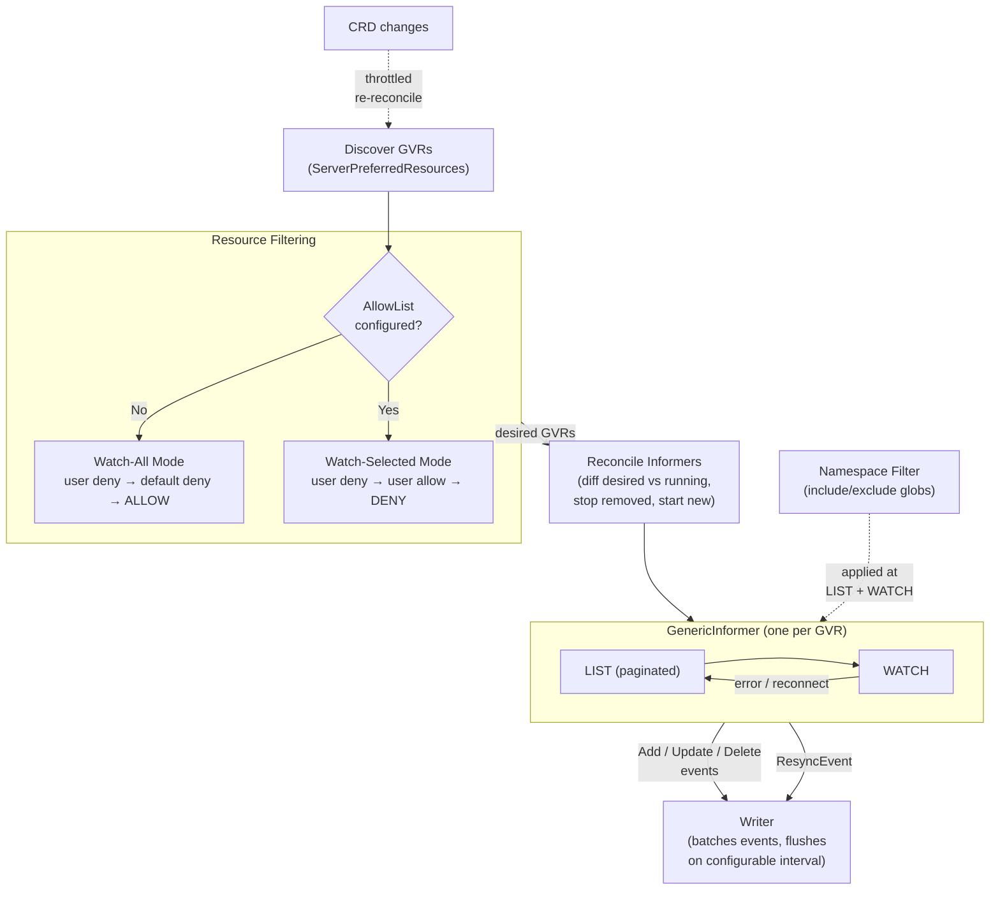
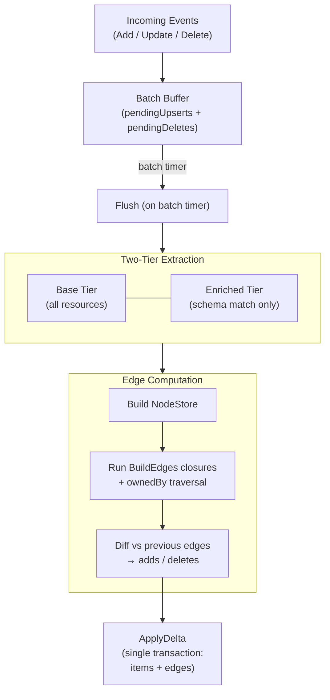
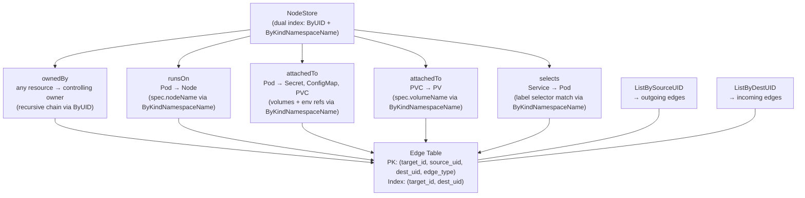
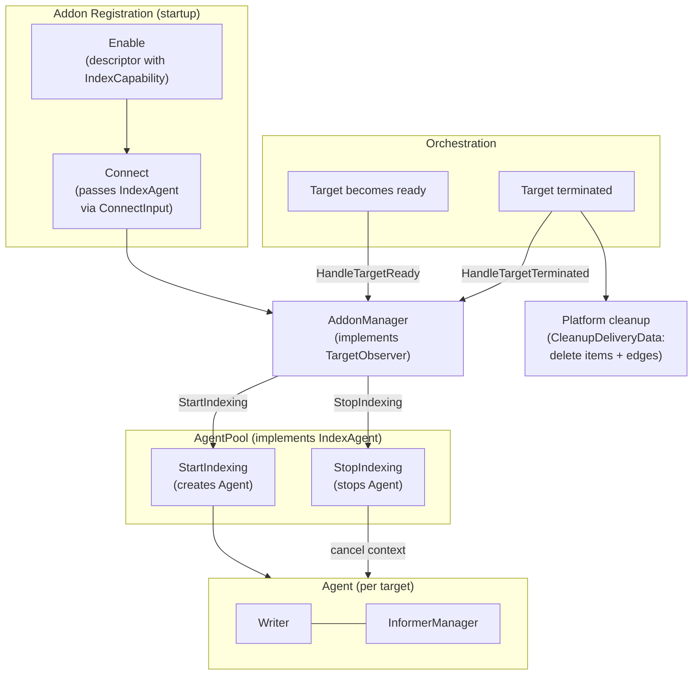

# Kubernetes Addon — Architecture Diagrams

Companion diagrams for [kubernetes-addon.md](kubernetes-addon.md). Each diagram corresponds to a major subsystem in the indexing pipeline.

## 1. Watch Pipeline and Configuration

How the inventory engine discovers, filters, and watches Kubernetes resources.

- **IndexConfig** controls per-target behavior: `Schema` (enrichment rules), `DenyList`/`AllowList` (resource filtering), `NamespaceFilter` (include/exclude glob patterns), `BatchInterval` (flush frequency, default 5s)
- **Default deny list** excludes high-volume/low-value resources by default: events, leases, endpoints, endpointslices, componentstatuses, OAuth tokens, projects, packagemanifests
- **Configuration precedence**: allow/deny lists are configured at two levels — addon-level (default for all targets) and per-target override (target properties). Both use `{apiGroups, resources}` entries with `"*"` wildcard support. The merged config determines the filtering mode: **watch-all** (no allow list) evaluates as user deny → default deny → ALLOW; **watch-selected** (allow list present) evaluates as user deny → user allow → DENY. In both modes, deny always wins over allow for the same resource
- **CRD reconciliation** is throttled to min 10s between cycles to avoid API server spam during bulk CRD changes (e.g. operator installs)
- **Informer startup** is serialized with a 10s initialization timeout per informer to avoid memory spikes during initial LIST phases
- **Informers** track only UID→resourceVersion mappings (not full objects) for minimal memory. On shutdown they emit Delete events for all tracked UIDs to clean up Writer state
- **Namespace filtering** uses `filepath.Match` glob patterns evaluated on each event — cluster-scoped resources always pass

## 2. Writer Flush — Two-Tier Extraction, Edges, and DB Writes

How the Writer batches events, extracts inventory, computes edges, and persists to the database.

- **Event loop** runs on a single goroutine for ordering safety. Deletes win over pending upserts for the same UID (late-delete protection)
- **Deduplication** by resourceVersion — if a resource hasn't changed since the last flush, its upsert is skipped
- **Base tier** extracts for all resources: name, namespace, uid, creationTimestamp, deletionTimestamp, labels, controllingOwnerUID, generation, conditions, GVR+Kind
- **Enriched tier** runs only for resources with a SchemaEntry: JSONPath fields with type coercion, ComputeExtra hook, annotations (opt-in, 64 char cap)
- **Heartbeat**: if no changes for 60s, sends an empty ApplyDelta as a keepalive signal
- **Resync path** (on ResyncEvent): atomically replaces all items for a target+type. Items only — edges are left untouched and recomputed on the next flush to avoid cross-GVR race conditions
- **Error recovery**: up to 3 attempts with exponential backoff (1s, 2s, 4s). On failure, pending batch is retained and `sentVersions`/`previousEdges` are NOT advanced — failed items and edges are never silently lost
- **DB tables**: `inventory_items` (PK: `targetID/UID`, columns: type, name, labels, target_id, observed JSON, conditions JSON) and `inventory_edges` (PK: `target_id, source_uid, dest_uid, edge_type`, secondary index on `target_id, dest_uid`)

## 3. Edge Discovery — Types, NodeStore, and Queries

How each edge type discovers its targets via the NodeStore, and how edges are queried by source or destination.

- **Two-stage closure pattern**: `BuildEdges` extracts static data from the resource at extraction time (e.g. `spec.nodeName`, volume refs, label selector), then returns a closure that resolves references against the full NodeStore at flush time. This separates cheap parsing from cross-GVR lookups
- **NodeStore** is a dual-indexed view of all current inventory nodes, built fresh each flush. `ByUID` (map[uid]→node) enables O(1) ownership chain traversal. `ByKindNamespaceName` (map[Kind][Namespace][Name]→node) enables O(1) cross-resource lookups. Cluster-scoped resources use `_NONE` as their namespace key
- **ownedBy** (recursive): walks the controlling `ownerReference` chain via ByUID lookups with cycle detection. A Pod owned by a ReplicaSet owned by a Deployment produces 2 edges (Pod→ReplicaSet, Pod→Deployment) — the original resource is always the source. Only the controlling owner (`controller: true`) is followed. Runs for ALL nodes automatically — no schema entry needed
- **attachedTo** (Pod): scans `spec.volumes` (secret, configMap, persistentVolumeClaim) and `spec.containers[].env` (secretKeyRef, configMapKeyRef) at extraction time, then looks up each ref by Kind+Namespace+Name at flush time
- **attachedTo** (PVC→PV): extracts `spec.volumeName`, looks up PersistentVolume as cluster-scoped (`_NONE`) at flush time
- **selects** (Service→Pod): extracts `spec.selector` label map, then iterates all Pods in the same namespace at flush time and matches where every selector key=value exists in pod labels
- **Edge diffing**: edges are keyed by `(SourceUID, DestUID, EdgeType)`. Each flush computes the full edge set and diffs against `previousEdges` — new keys become adds, missing keys become deletes, unchanged keys are skipped
- **Edge table**: PK `(target_id, source_uid, dest_uid, edge_type)` — `ListBySourceUID` uses PK prefix scan ("what does this resource connect to?"). Secondary index on `(target_id, dest_uid)` — `ListByDestUID` answers "what connects TO this resource?"

## 4. IndexCapability — Platform Integration and Lifecycle

How the indexing capability integrates with the addon lifecycle and platform orchestration.

- **AddonManager** validates that the addon declares `IndexCapability` before accepting an `IndexAgent` at Connect time. `HandleTargetReady` is gated on `State == Connected` — a disconnected addon won't start new indexing
- **AgentPool** implements both `DeliveryAgent` and `IndexAgent` — the same pool handles delivery and indexing. It builds K8s REST config from target properties + vault-backed service account tokens, then creates dynamic and discovery clients per target
- **StartIndexing / StopIndexing** are both idempotent — safe to call multiple times for the same target
- **StopIndexing does NOT delete inventory** — the addon only stops the Agent. Inventory + edge cleanup is the platform's responsibility, handled in the orchestration's `CleanupDeliveryData` transaction
- **Disconnect** preserves the `indexAgent` reference so `HandleTargetTerminated` can still stop orphaned agents. **Disable** calls `StopIndexing` + `DeleteByTarget` for each tracked target
- **Modularity boundary**: `InventoryWriter` and `DeliveryReporter` interfaces are the seam between in-process and external agent deployment models. The Agent and its delegates are identical in both — only the interface implementations change

