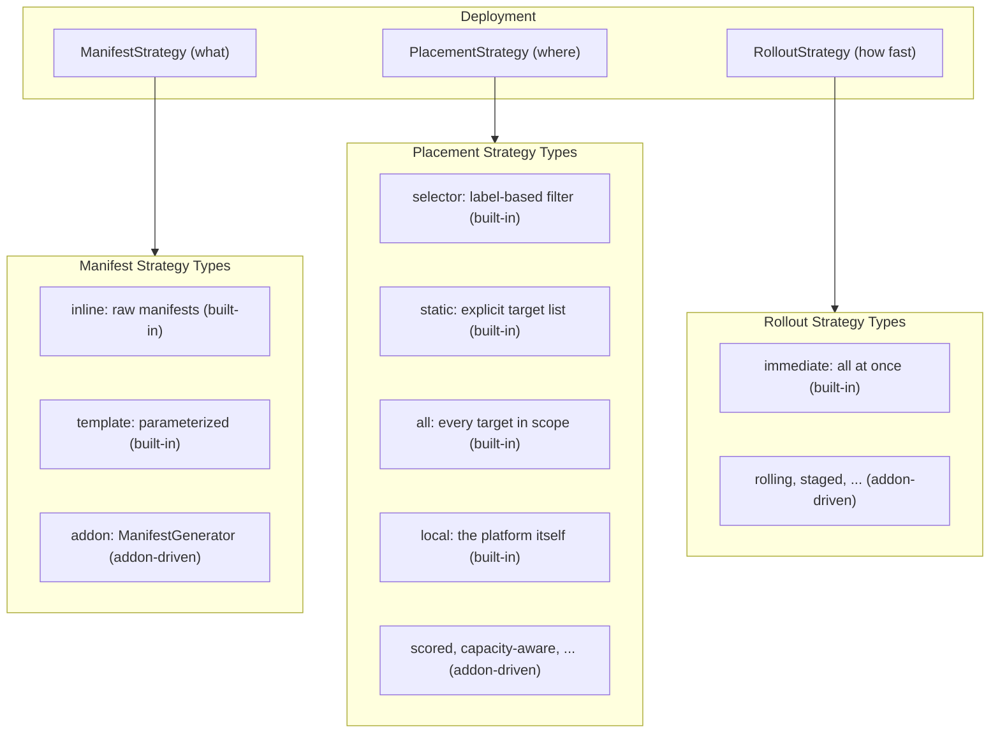

# Core Model

## What this doc covers

The stable vocabulary and contracts at the center of the architecture:

- the deployment abstraction
- delivery authorization
- strategy types
- the delivery contract
- target types and delivery agents
- the single-pod viability invariant

## When to read this

Read this when you need the platform's core mental model before diving into execution, transport, tenancy, or addon-specific detail.

## What is intentionally elsewhere

- Execution semantics, invalidation, rollout planning, and `DeploymentGroup`: [orchestration.md](orchestration.md)
- Fleetlets, channels, and platform routing: [fleetlet_and_transport.md](fleetlet_and_transport.md)
- Full authentication and trust design: [../authentication.md](../authentication.md)
- Managed resources: [../managed_resources.md](../managed_resources.md)
- Recursive platforms and provisioning: [platform_hierarchy.md](platform_hierarchy.md)

## Related docs

- [../architecture.md](../architecture.md)
- [addon_integration.md](addon_integration.md)
- [tenancy_and_permissions.md](tenancy_and_permissions.md)

## Deployment as three strategy axes

The management plane decomposes every deployment into three orthogonal, pluggable strategies:

```text
Deployment = ManifestStrategy × PlacementStrategy × RolloutStrategy
```

- **ManifestStrategy**: what to deploy. The platform provides built-in convenience types such as `inline` and `template` for simple cases. Non-trivial manifest generation is addon-driven through a registered `ManifestGenerator`. "Manifest" is used generically throughout this document: it means any declarative payload, including Kubernetes YAML, platform API objects, addon configuration documents, or provisioning specifications.
- **PlacementStrategy**: where it goes. The platform provides built-in static selection types such as `selector`, `static`, `all`, and `local`. Non-trivial placement such as scored ranking or capacity-aware binpacking is addon-driven.
- **RolloutStrategy**: how fast and in what order. The platform provides a built-in `immediate` strategy. Non-trivial rollout such as batching, gating, and staged progression is addon-driven.

What you deploy can be a function of where it goes: the manifest strategy receives target information for per-target customization. How fast you roll it out is independent of both.



## Delivery authorization

The platform is designed to limit the trust placed in the platform itself: a compromise of the management platform should not compromise an entire multi-tenant provider estate.

Delivery authorization is a first-class cross-cutting concern:

```text
Delivery authorization = CredentialPresentation × Provenance
```

- **Credential presentation**: whose credential applies resources at the target. The user's own token, a delegation service account, or the delivery agent's own service account are all valid modes.
- **Provenance**: cryptographic proof of who authorized the operation. A delivery can carry a user signature that the delivery agent verifies before applying.

These are orthogonal. Any provenance mode can compose with any credential-presentation mode. They describe delivery authority, not orchestration behavior, so they are not modeled as a fourth strategy axis.

When credentials or attestation are missing, expired, or insufficient, the deployment transitions to `PausedAuth`. This is the universal fallback: it pauses the deployment in a recoverable state until an authorized user resumes it with fresh approval.

This document keeps only the architectural boundary. The full trust model, signing model, and operational details live in [../authentication.md](../authentication.md).

## Strategy types

> NOTE: Many statements here read as definitive when they are, in fact, tentative suggestions to be explored further.

### Manifest strategy types

`inline` and `template` are (potentially) built-in convenience types. The `addon` type is the primary model for non-trivial generation.

| Type | Source | What triggers re-generation |
| --- | --- | --- |
| `addon` | Registered capability's `ManifestGenerator` callback | Addon calls `InvalidateManifests` |
| `inline` | Manifests provided directly in deployment spec | User PATCHes the deployment |
| `template` | Template and values rendered per target | User updates values or template |

### Placement strategy types

The built-in types cover static selection. Non-trivial placement is addon-driven.

| Type | Resolution | What triggers re-evaluation |
| --- | --- | --- |
| `selector` | Label selector against the workspace target pool | Target fleet changes such as labels, joins, and leaves |
| `static` | Explicit target list validated against workspace scope | User PATCHes the deployment |
| `all` | Every target in workspace scope, including children | Target fleet changes |
| `local` | Resolves to the platform itself | N/A |

### Rollout strategy types

`immediate` is the sole built-in rollout strategy. Non-trivial rollout is addon-driven.

| Type | Behavior | What triggers progression |
| --- | --- | --- |
| `immediate` | All targets receive changes simultaneously | N/A |

## Declarative placement and safety

Placement strategies are declarative. They express the desired target set at a point in time via `Resolve(pool) -> targets`. Removal is implicit: the platform computes the set difference between the previous resolved set and the current one. The placement strategy never explicitly asks to remove a target; it simply stops including it.

Safety rules:

- If `Resolve` returns an error or an empty set due to a transient failure, the platform must not shrink the target set.
- Shrinking happens only on a successful, confident resolution.
- If the rollout strategy's `Plan` returns an error, the platform must not begin delivery.

These rules keep the strategy contract simple without making transient failures destructive.

## Design invariant: single-pod viability

The platform kernel must function correctly as a single pod with an embedded database. This is a design invariant, not a degraded mode.

Core kernel subsystems must always satisfy the question: does this still work for a single-pod instance with embedded SQLite? Addons are not bound by this constraint; they may have their own scaling and deployment requirements.

This matters because the platform is recursively instantiable. A parent platform can deploy child platform instances as standard workloads. For that to remain economically viable at per-tenant or per-region granularity, the minimum footprint must stay at one pod, one process, one persistent volume, and no mandatory external services.

Concretely:

- **Storage is pluggable.** Embedded SQLite serves small instances; external Postgres serves larger ones behind the same interface.
- **Peer mesh is optional.** Single-replica instances skip peer discovery and forwarding entirely.
- **All core subsystems work with a single writer.** Multi-writer support is an optimization, not a correctness requirement.
- **No external service dependencies are required for core function.** External IdPs, object stores, or managed databases remain integrations rather than prerequisites.

## The delivery contract

A target is any endpoint that maintains the delivery contract. Internally, targets can vary widely; the platform only requires three capabilities:

1. **Accept a declarative payload.** The target's delivery agent receives manifests and acknowledges receipt.
2. **Apply it.** The delivery agent makes reality match the declared intent.
3. **Continuously report health.** Health is a streaming signal used for rollout progression, placement decisions, and user-visible status.

How those requirements are implemented is target-specific. Kubernetes targets use Server-Side Apply and resource watches. Platform targets create child deployments through the FleetShift API. Addon-defined targets implement domain-specific apply and health behavior.

When a delivery agent supports provenance verification, it can independently verify that a real user authorized the operation before applying. Provenance verification is a target capability, not a universal requirement of the delivery contract.

## Target types and delivery agents

### Example target types

**`kubernetes`**: a Kubernetes API server. The delivery agent uses Server-Side Apply, watches resource conditions for health, and prunes removed resources.

**`platform`**: a FleetShift platform instance. The delivery agent is a FleetShift API client that creates, updates, and deletes deployments on the child platform. This makes recursive deployment a direct consequence of the target model rather than a separate system.

**`local`**: the platform itself, resolved by the `local` placement strategy. This is the degenerate in-process form of a platform target and is used for platform-local orchestration such as `DeploymentGroup` and provisioning flows.

### Addon-registered target types

An addon can register a delivery capability and thereby make its backend a target. The addon implements the same delivery contract on its own delivery channel.

For example, a Thanos addon could register a `thanos` target type. Deploying recording rules would still be a standard deployment: a manifest strategy generates Thanos rule documents, placement selects Thanos targets, and rollout governs pacing.

Addon-registered targets participate in the same pipeline as built-in targets. The main difference is where the delivery agent logic lives.

### Delivery-agent requirements

Every delivery agent must support at least one mode from the authentication model described in [../authentication.md](../authentication.md). It verifies that an authorized user approved the operation before applying, whether by validating a bearer token, verifying a provenance attestation, or some future mode.

Verification, apply, and status reporting belong in the delivery agent itself. There is no separate broadly privileged reconciler that blindly trusts the platform. Target-side credentials never leave the target environment.
