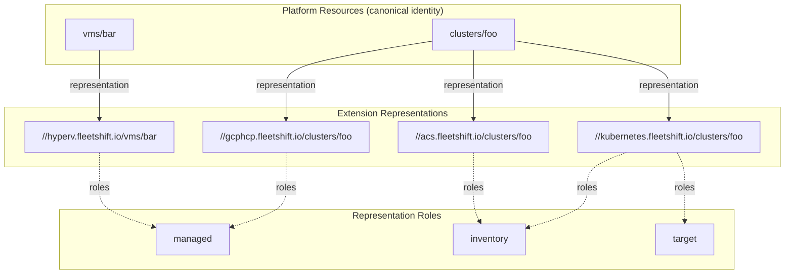

# Resource Identity and API Extension

## What this doc covers

The two-layer API model that separates canonical resource identity from extension-specific APIs:

- the architectural rationale for separating platform identity from extension APIs
- the platform resource: canonical identity, aggregated metadata, representations
- extension resources and API packages: service naming, proto packaging, versioning
- the resource identity model: claiming, correlation, aliases, conflict detection
- representations and relationships: how extensions model the same identity
- resource shapes taxonomy: managed, inventoried, target
- HTTP transcoding for multi-package services
- the inventory search API shape
- aggregation semantics for labels and conditions

## When to read this

Read this when you need to understand how multiple extensions can model the same logical resource without name collisions, how the platform API relates to extension APIs, or how resource identity works across the system.

## What is intentionally elsewhere

- Core strategy vocabulary and fulfillment model: [core_model.md](core_model.md)
- Managed resource lifecycle, fulfillment derivation, attestation: [../managed_resources.md](../managed_resources.md)
- Addon lifecycle and schema activation mechanics: [addon_integration.md](addon_integration.md)
- Fleet-wide indexing infrastructure and scale: [resource_indexing.md](resource_indexing.md)
- Target delivery protocol and reliability: [target_delivery_contract.md](target_delivery_contract.md)

## Related docs

- [../architecture.md](../architecture.md)
- [addon_integration.md](addon_integration.md)
- [resource_indexing.md](resource_indexing.md)
- [../managed_resources.md](../managed_resources.md)

---

## The two-layer API model

### Problem

Today, a managed resource extends a common gRPC service under a single proto package (`fleetshift.v1`). There is no separation between a canonical resource identity and the extension that manages it. Once inventory reporting introduces multiple extensions that model some aspect of the same resource — read or write — this breaks down. Either resource paths collide, or the resource is named something else despite logically sharing a common identity.

For example: a cluster may be provisioned by HyperShift, managed by ACS, targeted for delivery by a Kubernetes agent, and monitored by an observability addon. These all refer to the same logical cluster. They each need typed, separately lifecycled, non-conflicting APIs — yet they must unite under a single canonical resource identity.

### Solution: two layers

The platform introduces API separation at both the transport (HTTP and gRPC) and architectural levels:

1. **Platform API layer** — defines the canonical resource hierarchy and identity. Resource types have a place in this hierarchy regardless of which extension defines them. At this layer, the representation is generic: it tracks relationships, aggregates metadata, and correlates aliases. It is mostly read-only (labels are user-writable).
2. **Extension API layer** — implements resource functionality through typed, extension-specific schemas. Extensions can observe, manage (mapping to a fulfillment), or provide delivery connectivity. Each extension registers services in its own proto package, differentiated at the transport level.

The resource name (`clusters/foo`) is identity-equivalent across services when referring to the same logical resource. `//gcphcp.fleetshift.io/clusters/foo` and `//fleetshift.io/clusters/foo` refer to the same logical resource through different APIs.




---

## Platform resource

The platform resource is the canonical identity for a logical resource. Its message schema is generic and does not change as extensions are added, but the services (and thus HTTP paths) are dynamic — new resource types add new services.

### Shape


| Field              | Writability    | Description                                                                         |
| ------------------ | -------------- | ----------------------------------------------------------------------------------- |
| `name`             | Server-managed | AIP-122 resource name (e.g. `clusters/foo`)                                         |
| `uid`              | Server-managed | Globally unique identifier                                                          |
| `labels`           | User-writable  | Direct user labels, declarative-friendly                                            |
| `effective_labels` | Server-managed | Union of user labels and extension-contributed labels (namespaced), per AIP-129     |
| `conditions`       | Server-managed | Aggregated from extension representations, namespaced by source                     |
| `representations`  | Server-managed | References to extension resources modeling this identity, with their declared roles |
| `aliases`          | Server-managed | Namespaced key:value pairs for alternate identifiers                                |
| `relationships`    | Server-managed | Links to other platform resource identities (semantic relationships)                |


### Materialization

Platform resources are implicit by default: auto-created when the first extension resource with that identity is created. They can also be pre-created for label or IAM attachment before any extension resource exists. This makes the platform resource declarative-friendly for the writable subset (labels, existence).

### Deletion semantics

The platform resource is declarative-friendly — it can be explicitly created and deleted. Additionally, authorized extensions can signal that the resource no longer exists (e.g., a GCP addon confirms a cluster was destroyed), which can trigger deletion of the platform identity.

Open nuance: if the platform identity was pre-created (before any extension resource existed), deletion authority may differ. Whether pre-established identity has stronger persistence guarantees is an open design question.

We probably want deletion to primarly come from user input. If a user is managing the cluster, it's clear when it should be deleted. If the delete signal comes from somewhere else, we should not remove the user's intent. Even when a cluster is imported, the platform identity assignment is described by a user at some point.

### Dynamic service registration

Services for platform resources are dynamic. When a new resource type is installed (e.g., `clusters`, `vms`), the platform registers a corresponding platform service with the generic message shape. The service provides standard CRUD operations (Create, Get, List, Delete) scoped to the platform resource fields.

---

## Extension resources and API packages

Extensions define typed APIs as service extensions. Each addon chooses its own naming, independently of the platform.

### Service name (AIP-122, versionless)

The **service name** is the identifier used in full resource names. It is versionless and open-ended. Addons choose their own service names; the platform imposes no naming convention beyond uniqueness.

Examples:

- `gcphcp.fleetshift.io` — first-party GCP HCP addon
- `kubernetes.fleetshift.io` — first-party Kubernetes addon
- `clusters.acme.com` — third-party addon

### Proto package (versioned)

The **proto package** follows standard proto conventions and includes the version:

- `gcphcp.fleetshift.v1`
- `kubernetes.fleetshift.v1`
- `acme.clusters.v1`

gRPC service names follow proto conventions: `{proto_package}.{Singular}Service` (e.g., `gcphcp.fleetshift.v1.ClusterService`).

### Full resource names (AIP-122)

Full resource names use the versionless service name:

```
//gcphcp.fleetshift.io/clusters/foo
//kubernetes.fleetshift.io/clusters/foo
//fleetshift.io/clusters/foo
```

The resource name (`clusters/foo`) is identity-equivalent across services when referring to the same logical resource.

### URLs (AIP-127)

URLs include the version per AIP-127 transcoding:

```
/apis/gcphcp.fleetshift.io/v1/clusters/foo
/apis/kubernetes.fleetshift.io/v1/clusters/foo
/apis/fleetshift.io/v1/clusters/foo
```

### Versioning

Versioning is defined separately from the service name. An addon registers a service name once, and versions its proto package and URL paths independently. Resource names remain stable across API version evolution because the service name is versionless.

---

## Resource identity model

### Naming types (AIP-122)

The implementation's naming types mirror AIP-122 terminology:

| Type               | Example                            | Description                                                           |
| ------------------ | ---------------------------------- | --------------------------------------------------------------------- |
| `ResourceID`       | `foo`                              | Leaf segment identifier (rarely used in isolation)                    |
| `ResourceName`     | `clusters/foo`                     | Collection-qualified resource name; the primary identity type         |
| `FullResourceName` | `//gcphcp.fleetshift.io/clusters/foo` | Globally unique including service; used in attestation and cross-service references |
| `CollectionID`     | `clusters`                         | Single collection segment (rarely used in isolation)                  |
| `CollectionName`   | `clusters`                         | Full path to a collection; generalizes to hierarchical names          |

`ResourceName` is the standard currency for domain APIs. `ResourceID` is used only at boundaries (e.g. parsing a resource name from an HTTP path segment). The current implementation is flat (`clusters/foo`), but `CollectionName` and `ResourceName` do not structurally prevent future hierarchy.

### Persistence of resource identity

The repository layer persists resource identity as two separate columns: `collection_name` (the full parent `CollectionName`, e.g. `clusters` or `publishers/123/books`) and `resource_id` (the leaf `ResourceID`, e.g. `prod` or `les-mis`). The composed `ResourceName` is reconstructed on read by joining `collection_name + "/" + resource_id`.

This split enables exact-match listing by collection (`WHERE collection_name = ?`) rather than prefix matching, which would over-include descendants in nested collection hierarchies. The uniqueness constraint is `(collection_name, resource_id)` per table. `ResourceName` remains the only identity type exposed by the domain; the split is an infrastructure concern.

### Identity uniqueness

A resource name is unique within a **platform identity domain**. Extension collections participate in that domain only when their resource type registration maps them to the corresponding platform resource type.

Once `clusters/foo` exists, it is one logical resource regardless of how many extensions define APIs for it.

### Claiming protocol

The first extension to create a resource with a given name establishes the identity (and triggers platform resource materialization). Subsequent extensions link to the same identity when they either:

1. Use the same registered identity domain and relative name, or
2. Have aliases that correlate to an existing identity without violating alias uniqueness constraints.

### Aliases

Aliases are namespaced key:value pairs for alternate identifiers. They enable cross-extension correlation when the canonical name is not known.

Examples:

- `gcp/project-id:my-project/cluster-id:abc123`
- `sig-multicluster/cluster-id:550e8400-e29b-41d4-a716-446655440000`
- `acs/cluster-id:acs-12345`

### Conflict detection

Multiple extensions defining the same resource name is expected and correct — they unify on the same identity. Name sharing across extension representations is expected when the representations are registered into the same platform identity domain.

Conflicts arise from:

- **Contradictory alias claims**: extension A asserts `clusters/foo` has `kube-system-ns-uid=1` while extension B asserts `kube-system-ns-uid=2`.
- **Unauthorized identity claims**: an extension attempts to claim a resource name without authorization.
- **Multiple identity binding**: an extension resource attempts to bind to multiple platform identities.

---

## Representations and relationships

### Terminology

- A **platform resource** is the canonical identity for a logical resource.
- An **extension representation** is an extension API resource that represents the same platform identity through a typed, extension-specific schema.
- Each representation declares one or more **representation roles** (`managed`, `inventory`, `target`).
- Representations are not semantic relationships; they are typed API surfaces for the same identity.

### Extension representations

The platform resource tracks its representations. Each declares its roles:


| Role        | Description                                                         | Mutual exclusivity                               |
| ----------- | ------------------------------------------------------------------- | ------------------------------------------------ |
| `managed`   | The extension resource has a writable spec driving a fulfillment    | Mutually exclusive with `inventory` (for now)    |
| `inventory` | The extension resource reports observed state                       | Mutually exclusive with `managed` (for now)      |
| `target`    | The extension resource provides delivery connectivity configuration | Can combine with either `managed` or `inventory` |


A representation can combine `target` with either `managed` or `inventory`. For example, `//kubernetes.fleetshift.io/clusters/foo` might declare roles: `target`, `inventory`.

Example: platform resource `clusters/foo` has representations:

- `//gcphcp.fleetshift.io/clusters/foo` — roles: `managed`
- `//kubernetes.fleetshift.io/clusters/foo` — roles: `target`, `inventory`
- `//acs.fleetshift.io/clusters/foo` — roles: `inventory`

### Semantic relationships

Semantic relationships are links between different **platform resource identities**. They connect distinct logical resources, not typed API surfaces for the same identity.

Examples:

- Pod → Service
- Container → Image
- Node → Cluster

These are modeled generically on the platform resource (repeated field or map), not requiring message schema extension.

Open question: whether semantic relationships should be schema-extended per resource type or remain generic.

---

## Resource shapes taxonomy

Extension resources fall into three shapes based on their representation roles. These are not mutually exclusive at the extension level — a single extension resource can combine roles.

### Managed resource

A managed resource has a writable spec that drives a fulfillment. It also has common metadata (labels, conditions) and optionally extension-defined observation schema. It is declarative-friendly.

The distinguishing trait is the spec → fulfillment lifecycle. See [../managed_resources.md](../managed_resources.md) for the full design.

### Inventoried resource

An inventoried resource has common metadata (labels, conditions) and extension-defined observation schema, but no writable spec and no fulfillment. It is read-only from the user's perspective; reported by addons.

### Target resource

A target resource provides configuration for delivery connectivity. It has extension-defined schema and is declarative-friendly (can be managed by GitOps tooling or operator configuration).

### Common surface

Managed and inventoried resources share the same common metadata surface (labels, conditions) and can both define observation schema. The difference is solely whether the resource has a user-writable spec driving fulfillment.

A single extension resource can combine roles. For example, `//kubernetes.fleetshift.io/clusters/foo` can be both a target resource and an inventory reporter.

Stable generated values that should appear in the indexed projection are modeled as `properties`; see [resource_indexing.md](resource_indexing.md#inventory-item-shape).

---

## HTTP transcoding

Multiple extension services coexist on one HTTP server. Since different proto packages produce different gRPC service names, gRPC routing works naturally. HTTP requires explicit path differentiation.

### Path scheme

```
/apis/{service_name}/{version}/{resource_path}
```

Examples:

- `/apis/gcphcp.fleetshift.io/v1/clusters/foo`
- `/apis/kubernetes.fleetshift.io/v1/clusters/foo`
- `/apis/fleetshift.io/v1/clusters/foo`

The platform API may also be accessible at a short alias (e.g. `/v1/clusters/foo`).

### gRPC

gRPC is already differentiated by fully-qualified service name in the proto package. No change is needed beyond supporting addon packages. The `DynamicServiceMux` routes by service name as it does today.

### Open question

Whether to support a short-form path for a "default" service context (the platform API), allowing `/v1/clusters/foo` as a shortcut for `/apis/fleetshift.io/v1/clusters/foo`.

---

## Inventory search API

The inventory search API provides cross-cutting fleet-wide discovery and aggregation across all resource shapes.

### Shape

A custom GET method on the platform API surface over an arbitrary scope:

```
GET /apis/fleetshift.io/v1/{scope}:searchResources?filter={cel_expression}
```

- **Scope**: a cluster, a workspace, the whole platform, or any other level of the resource hierarchy.
- **Filter**: a CEL expression for filtering.
- **Pagination**: follows AIP conventions.

If the platform later standardizes a short-form alias for its own API, the same method could also be exposed at `/v1/{scope}:searchResources`.

### Response shape

Responses include:

- Resource identity (full name including service)
- Common metadata (labels, conditions)
- A `google.protobuf.Struct` payload for extension-specific fields

The Struct payload avoids unbounded `oneof` / `Any` / type proliferation while still carrying typed data.

### Relationship to typed APIs

Search is for fleet-wide discovery and aggregation. Typed extension APIs are for full-fidelity CRUD. The search index is a projection, not a replacement for the typed APIs.

---

## Aggregation semantics

The platform resource aggregates metadata from its extension representations.

### Labels

Labels are a union with namespace prefixes. `effective_labels` merges:

- **User-set labels** (unnamespaced): set directly on the platform resource via its `labels` field.
- **Extension-contributed labels** (namespaced): contributed by extension representations, prefixed with `{addon_id}/{key}`.

This follows AIP-129 for the `labels` / `effective_labels` split.

### Conditions

Conditions are additive and namespaced by source extension. Each condition carries its source extension as metadata.

No implicit synthetic rollup condition is generated. Source conditions remain authoritative. Any future rollup is an explicitly registered derived projection.

---

## Open questions

1. **Semantic relationship extensibility**: whether semantic relationships dynamically extend the platform resource message or remain generic (repeated field / map).
2. **Observed-state model rework**: the current `properties` vs `observations` split may collapse into a unified observation model. Current documents use `properties` for the stable-value bucket; whether that remains distinct from `observations` is deferred to a separate design effort.
3. **Extension API versioning mechanics**: service name is stable; proto package and URL version evolve independently. The exact mechanics of multi-version coexistence need specification.
4. **Short-form HTTP path aliases**: whether `/v1/clusters/foo` serves as an alias for `/apis/fleetshift.io/v1/clusters/foo`.
5. **Pre-created identity persistence**: whether platform resources that were pre-created (before any extension resource existed) have stronger persistence guarantees against extension-initiated deletion.


