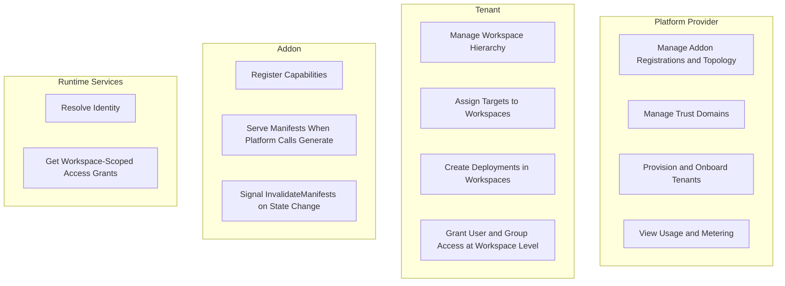
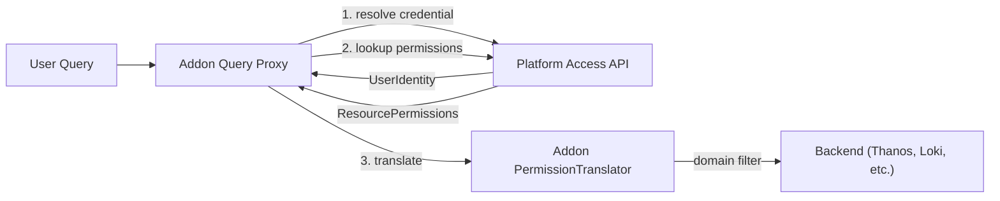

# Tenancy And Permissions

## What this doc covers

The organizational and authorization boundary of the platform:

- provider, tenant, and workspace roles
- workspace resource hierarchy
- the rationale for native multi-tenancy
- the generic permission lookup model
- the boundary between platform authorization and addon-side filtering

## When to read this

Read this when you need to understand who owns what, how access is scoped, and what the platform versus an addon is responsible for in authorization decisions.

## What is intentionally elsewhere

- Delivery authorization, trust anchors, provenance, and `PausedAuth`: [../authentication.md](../authentication.md)
- Provider/factory topology proposals: [../provider_consumer_model.md](../provider_consumer_model.md)
- Recursive platforms as a stronger isolation boundary: [platform_hierarchy.md](platform_hierarchy.md)
- Addon contracts and managed resources: [addon_integration.md](addon_integration.md)

## Related docs

- [../architecture.md](../architecture.md)
- [core_model.md](core_model.md)

## Organizational model

The platform is natively multi-tenant.

- A **platform provider** operates the management plane and controls addon installation, topology, trust domains, and tenant onboarding.
- **Tenants** exist within that system and require authorization isolation as a hard boundary.
- Recursive instantiation remains available when a stronger boundary is needed, such as separate process, storage, or identity configuration per instance.

The exact relationship between provider and tenant is still intentionally unresolved here. The current provider/consumer exploration lives in [../provider_consumer_model.md](../provider_consumer_model.md).

### Actors



### Responsibilities

**Platform provider** manages the platform instance, addon topology, trust domains, and tenant lifecycle. In recursive topologies, a parent platform also manages child platform instances.

**Tenant** operates within the platform under authorization isolation. Tenants manage workspace trees, assign targets, create deployments, and grant access to users and groups.

**Addon** is a platform-level integration. It registers capabilities and serves manifests or query-time filtering logic without directly owning workspace or tenant semantics.

## Resource hierarchy

```text
Platform Instance
  ├── Tenant "Acme Corp"
  │     ├── Workspace "Engineering"
  │     │     ├── Workspace "Frontend"
  │     │     │     └── targets: [prod-us-east, staging-us-east]
  │     │     │     └── deployments: [metrics-collection -> prod-us-east]
  │     │     └── Workspace "Backend"
  │     │           └── targets: [prod-us-west]
  │     └── Workspace "Data Science"
  │           └── targets: [ml-gpu-1]
  └── Tenant "Globex Inc"
        └── Workspace "Production"
              └── targets: [prod-eu-west]
```

Key rules:

- Workspaces inherit from parent workspaces.
- A deployment can target only within the workspace subtree visible to it.
- Users are granted access to workspaces rather than being members of them.
- A target belongs to exactly one workspace.
- Tenants are authorization-isolated from one another.
- Addons should not need to reason about tenant IDs or workspace IDs directly.

## Generic permission model

The platform does not expose addon-specific access endpoints. Instead, it offers a generic permission lookup. Addons define the permissions and resource attributes that matter in their domain; the platform evaluates those permissions against identity and workspace grants.



This means:

- the platform knows who has access to which resources through which relationships
- the addon defines what those permissions mean in its own domain
- the addon translates generic permission results into backend-specific filters

The `PermissionTranslator` is addon-side code. The platform resolves the organizational graph; the addon consumes the result as a flat list of permitted resource permissions.

## Why native multi-tenancy

<!-- TODO: The isolation model between tenants (beyond authorization) is still under design. -->

Native multi-tenancy gives the platform a built-in inter-organization boundary without requiring a separate process per tenant. The workspace tree provides intra-tenant scoping, while tenant boundaries provide inter-tenant authorization isolation.

When a stronger boundary is required, recursive instantiation remains available. The two models coexist rather than replacing each other.

## Deliberately deferred

This document establishes authorization isolation as required, but it does not define:

- the full grant and inheritance model
- the non-authorization isolation primitives between tenants
- the concrete permission schema language used by addons

Those remain separate design exercises, with current pointers collected in [open_questions.md](open_questions.md).
