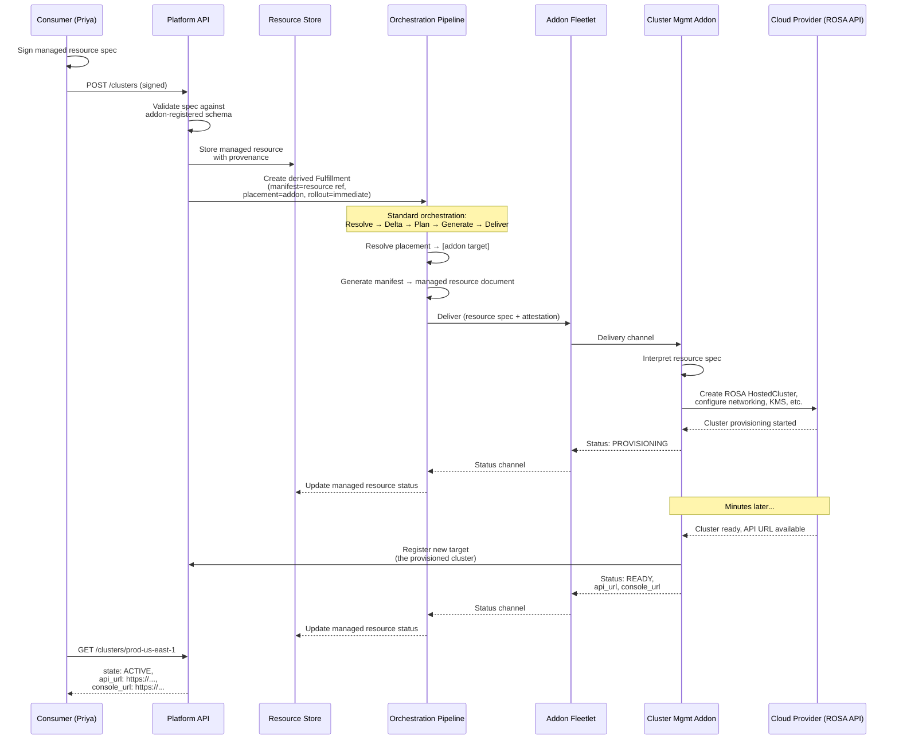

# Managed resources

> **Naming note.** This document uses "managed resource" as the working term for addon-driven, consumer-facing resource types. Alternative names worth revisiting as the design matures: **offering** (captures the provider/consumer relationship with zero Kubernetes namespace collision). "Platform resource" was the original term but was retired because "platform" already refers to the management plane itself.
>
> **Fulfillment** is the core kernel primitive — the internal orchestration unit that drives the reconciliation loop. It is not directly created or edited by users. User-facing concepts (managed resources, campaigns, deployments) create and drive Fulfillments. See [Architectural layering](#architectural-layering) below.

## Problem

How do we offer an extensible core, but allow addons to offer "managed resource" like semantics, that incorporate decade+ of best practices?

Example: imagine a full featured cluster management addon. It should handle many domain specific use cases:

- Provision & configure managed clusters directly targeting managed provider APIs, likely with passthrough auth (e.g. ROSA or ARO clusters)
- Provision & configure clusters through native self managed options (e.g. wrapping openshift assisted installer)
- Provision & configure clusters through operators like CAPI or HyperShift
- Import existing clusters
- Upgrade these clusters (either individually or through a campaign, see https://redhat.atlassian.net/jira/software/c/projects/FM/list?selectedIssue=FM-81 )
- Full exploitation of the core placement and rollout strategy abstractions for progressive delivery, maintenance windows, etc., encoding specific cluster management best practices
- Assist in knowable operational issues in the course of provisioning, upgrades, or other configuration changes
- Manage cluster pooling strategies
- View the state of clusters and their underlying nodes (inventory)
- Integration with other cluster-related addons, like ACS, MCOA, ODF, ...

You could imagine similar domain specific experiences for other managed resource types:

- VMs
- Argo instances
- Model serving
- ...

These are the consumer-facing "nouns" of the platform, in contrast to the addon-facing core abstractions. In some sense, the whole interesting architecture of FleetShift is getting these two competing halves right:

- An agnostic "fleet core" that encodes only the most generic, consistent, "meta" or cross cutting best practices. Things like durability, resilience, extensibility, pooling, fleet-awareness, placement and rollout control, inventory, IAM, metering, ...
- Thoroughly domain specific "nouns" that are opinionated and encode all of the best practice and real world experience we can muster

## Proposal

_Managed resources_ are the "consumer-facing nouns" of the platform. They are addon-driven. Addons register to provide the functions for one or more managed resource types.

Managed resources are driven by the core Fulfillment abstraction. A managed resource is a _registered resource type_ (as in, a manifest resource type). An addon defines how Fulfillments are derived from managed resources. In a typical case, a managed resource maps to a single, immediate placement with the addon itself as the target.


Example: a cluster management addon registers the `clusters` managed resource type. A consumer requests a ROSA cluster. (**These examples illustrate the structural relationships between managed resources, derived Fulfillments, and addon registration — not a specification of the actual API shape. Field names, nesting, and conventions are assumed for readability.**)

#### Consumer-facing managed resource

```json
POST /clusters
{
  "name": "prod-us-east-1",
  "spec": {
    "provider": "rosa",
    "version": "4.16.2",
    "region": "us-east-1",
    "compute_pools": [
      {
        "name": "workers",
        "instance_type": "m5.2xlarge",
        "replicas": 3,
        "autoscaling": { "min_replicas": 3, "max_replicas": 12 }
      }
    ],
    "network": {
      "machine_cidr": "10.0.0.0/16",
      "service_cidr": "172.30.0.0/16",
      "pod_cidr": "10.128.0.0/14"
    },
    "encryption": {
      "etcd_encryption": true,
      "kms_key_arn": "arn:aws:kms:us-east-1:123456789012:key/mrk-abc123"
    }
  }
}
```

The consumer's agent signs this request. The platform validates the spec against the addon-registered schema, stores the resource, and returns it with platform-managed status fields:

```json
{
  "name": "clusters/prod-us-east-1",
  "uid": "a1b2c3d4-e5f6-7890-abcd-ef1234567890",
  "spec": { "..." },
  "state": "PROVISIONING",
  "reconciling": true,
  "status": {
    "conditions": [
      {
        "type": "Provisioning",
        "status": "True",
        "message": "Creating ROSA cluster infrastructure"
      }
    ]
  },
  "create_time": "2026-04-21T14:30:00Z",
  "provenance": {
    "signature": {
      "signer": {
        "subject": "priya@acme.corp",
        "issuer": "https://sso.acme.corp"
      },
      "content_hash": "sha256:9f86d08...",
      "signature_bytes": "MEUCIQ..."
    }
  }
}
```

The `spec` is entirely addon-defined — the platform stores it opaquely but validates it against the addon's registered schema. The `state`, `reconciling`, `status`, `provenance`, and timestamps are platform-managed, following the same patterns as Deployment (AIP-128 declarative-friendly).

#### Derived Fulfillment

The platform mechanically derives a Fulfillment from the managed resource. Because the addon is the target, the derivation is fixed — no configurable transformation:

```json
{
  "name": "fulfillments/_managed/clusters/prod-us-east-1",
  "manifest_strategy": {
    "type": "MANAGED_RESOURCE",
    "managed_resource": {
      "resource_type": "clusters",
      "resource_name": "clusters/prod-us-east-1"
    }
  },
  "placement_strategy": {
    "type": "STATIC",
    "static": {
      "targets": ["targets/cluster-mgmt-addon"]
    }
  },
  "rollout_strategy": {
    "type": "IMMEDIATE"
  },
  "provenance": {
    "signature": { "..." },
    "managed_resource_ref": "clusters/prod-us-east-1"
  }
}
```

- **Manifest strategy**: `MANAGED_RESOURCE` is a reference to the stored resource spec. When the platform delivers to the addon, it sends the full managed resource document. The addon interprets it — in this case, calling the ROSA API to create a HyperShift-based HostedCluster, configuring networking, setting up the KMS-backed etcd encryption, and registering the resulting cluster as a new target.
- **Placement**: a single static target — the addon's own delivery endpoint. The addon registered this target during capability registration. Since the addon is a delivery agent for its own target type, it receives the managed resource through the standard delivery channel.
- **Rollout**: immediate. A single managed resource means a single target means a single delivery — rollout strategy is degenerate.
- **Provenance**: derived from the original managed resource's signature. A verifier can chain from the Fulfillment's provenance back to the user's signed resource intent. The `managed_resource_ref` links the two, and the derivation rule is mechanically fixed (the addon is always the target), so a verifier can confirm the Fulfillment was correctly derived without trusting the platform.

This Fulfillment flows through the standard orchestration pipeline: Resolve → Delta → Plan → Generate → Deliver. The only difference from a directly-authored Fulfillment is how it was created (derived from a managed resource) and how its provenance chains (through the managed resource rather than directly signed).

#### Addon resource type registration

When the cluster management addon connects, it registers its managed resource types as part of capability registration:

```json
{
  "capabilities": [
    {
      "name": "cluster-mgmt",
      "managed_resource_types": [
        {
          "resource_type": "clusters",
          "schema": {
            "format": "JSON_SCHEMA",
            "definition": {
              "type": "object",
              "required": ["provider", "version", "region"],
              "properties": {
                "provider": {
                  "type": "string",
                  "enum": ["rosa", "aro", "hypershift", "assisted-installer"]
                },
                "version": {
                  "type": "string",
                  "pattern": "^4\\.[0-9]+\\.[0-9]+$"
                },
                "region": { "type": "string" },
                "compute_pools": { "..." },
                "network": { "..." },
                "encryption": { "..." }
              }
            }
          },
          "delivery_target": "self",
          "status_projection": {
            "fields": ["state", "conditions", "api_url", "console_url"]
          }
        }
      ]
    }
  ]
}
```

- **`resource_type`**: the API path segment. The platform exposes `POST /clusters`, `GET /clusters/{name}`, etc. using this name.
- **`schema`**: validates consumer input before storage. Rejections happen at the API boundary, not during delivery.
- **`delivery_target: "self"`**: the mechanical derivation rule. The derived Fulfillment always targets this addon. This is the common case — and the only case where the derivation is fixed and the attestation chain is trivial (the addon is trusted by virtue of its registration, and the platform is a courier). The OPEN QUESTION above asks whether we should support other targets; for now, `"self"` is the only option.
- **`status_projection`**: which fields from the addon's status reports are surfaced to the consumer. The addon may track internal details (which management cluster hosts this HCP, how many DNS records were created, provisioning step progress) — only the projected fields appear in the consumer-facing `GET /clusters/{name}` response.

This registration is itself signed by the addon and stored as part of the addon's capability record. A delivery-side verifier uses it as evidence: "the addon claimed ownership of `clusters` resources with `delivery_target: self`, so a Fulfillment derived from a `clusters` resource that targets this addon is consistent with the addon's registration."

### Attestation

Managed resources use the same signed input model as deployments. The attestation envelope (`SignedInput`) accepts a typed content variant — `ManagedResourceContent` alongside `DeploymentContent` — through a common `InputContent` protocol. Both are signed, verified, and derived through the same pipeline; constraint derivation and identity extraction dispatch on the content type.

`ManagedResourceContent` carries the resource spec and the addon reference (`addon_id`). The user signs the "what" and the "who" — not the "how" or the trust path. This parallels how a deployment's signed content includes the strategy type and addon identity, but not the trust anchor used to verify the addon's output.

The fulfillment relation — addon-signed evidence describing how the resource maps to a fulfillment — is external evidence in the `VerificationBundle`, not part of what the user signs. Relation types are platform-defined — the verifier has built-in logic for each — so they use strong typing rather than an open attributes pattern.

The first relation type is `RegisteredSelfTarget`: 1:1 manifest delivery to the addon itself. The addon signs over `{relation_type, resource_type}` to claim: "I own resources of this type, and fulfillments derived from them target me directly." At verification time, the verifier looks up the matching relation from the bundle by `(addon_id, resource_type)`, verifies the relation's signature cryptographically and against the trust store (the signer's key must be recognised by the claimed trust anchor), checks consistency (relation resource type matches content resource type, relation signer matches the declared addon), and derives constraints: placement is static to the addon, manifests must match the user's signed spec (the content is deterministic — like `inline` for deployments). Future relation types (CEL-based derivation, multi-target mappings) add to the typed union, each with platform-defined verification logic.

Additionally, we expect addons to eventually produce other platform objects as part of delivery — a managed resource may trigger related resource or deployment creations. In this case, there needs to be trusted evidence that constrains the resulting artifacts within the user's original resource intent. The fulfillment relation is a plausible foundation: a verifier could test that the original intent was to a resource owned by this addon, that the addon was an appropriate target based on its signed relation, and that resulting manifests and placement are signed by the authorized addon. Whether the current relation model is sufficient for this multi-artifact case, or whether it needs additional evidence (e.g. an addon-signed production manifest linking the managed resource to the artifacts it spawns), is an open question.



The key property: the platform is a courier throughout. It stores the user's signed intent, mechanically derives a Fulfillment, and delivers the resource spec to the addon through the standard pipeline. The addon — a separate process with its own identity — is the only component that interprets the spec and interacts with the cloud provider. Provenance chains from the user's signature through the managed resource to the derived Fulfillment to the delivery attestation, without the platform ever needing to understand what a "ROSA cluster" is.

### Architectural layering

The platform separates the core orchestration primitive from user-facing concepts:

**Fulfillment** (kernel primitive): the internal unit of orchestration. Each Fulfillment maintains independently versioned strategy streams (manifest, placement, rollout) that drive the reconciliation loop — resolve → delta → plan → generate → deliver. Fulfillments are not directly created or edited by users. Any strategy version advance bumps the Fulfillment's generation, providing configuration history at the kernel level for audit, debugging, and rollback.

**User-facing concepts** (thin layers over Fulfillments):

- **Managed resource**: continuous reconciliation, addon-driven or config-only, typed collections (`/clusters`, `/monitoring-stacks`). Creates and drives a Fulfillment.
- **Campaign**: run-to-completion fleet operations, immutable once started. Creates Fulfillments for each stage.
- **Deployment**: the "just deploy this" convenience. A thin wrapper that creates a single Fulfillment. Simple edit/status API.

Each user-facing concept defines its own API surface, lifecycle rules, and editability. The Fulfillment has no direct edit API — it's driven exclusively through the concept that owns it. This avoids the problem where higher-level concepts must restrict a general-purpose primitive ("you can't edit this deployment because it's owned by a managed resource"). Instead, the primitive is inert by default, and each concept grants specific capabilities.

### Versioned intent

Managed resource specs are stored as immutable versions — the user-facing version history. Each update to a managed resource creates a new version; the managed resource HEAD table tracks which version is current.

```sql
CREATE TABLE resource_intents (
  resource_type TEXT NOT NULL,
  name          TEXT NOT NULL,
  version       INTEGER NOT NULL,
  spec          TEXT NOT NULL,       -- jsonb in Postgres
  provenance    TEXT,
  created_at    TEXT NOT NULL,
  PRIMARY KEY (resource_type, name, version)
);
```

Each version is immutable — INSERT only, never UPDATE. Postgres: `PARTITION BY LIST (resource_type)`, partitions at addon registration. Benefits: rollback (point to version N-1), audit (what spec when), attestation (per-version signature), debugging (diff versions).

Resource intent versioning is a managed resource layer concern, distinct from Fulfillment strategy versioning (see [below](#fulfillment-strategy-versioning)). When a new resource intent version is created, the platform creates a corresponding manifest strategy version on the Fulfillment (referencing the new intent version), which bumps the Fulfillment's generation and triggers reconciliation. But the two version histories are independent: the resource intent tracks what the user asked for; the Fulfillment's manifest strategy tracks what the system was configured to deliver.

### Fulfillment strategy versioning

Each strategy type on a Fulfillment has its own append-only version stream scoped to that Fulfillment. The Fulfillment tracks the current version of each strategy. Any strategy version advance bumps the Fulfillment's generation, which is the orchestration loop's signal to reconcile.

```
fulfillment:
  id: F1
  manifest_strategy_version:  3
  placement_strategy_version: 2
  rollout_strategy_version:   1
  generation: N
  state:     {api_url, provider_id, ...}

manifest_strategies:   (fulfillment_id, version, type, content, created_at)
placement_strategies:  (fulfillment_id, version, type, content, created_at)
rollout_strategies:    (fulfillment_id, version, type, content, created_at)
```

Strategy versions are scoped to a Fulfillment — each Fulfillment maintains independent version counters per strategy type. This cleanly separates two distinct version histories:

- **Resource version history** (what the user asked for over time) — stored in `resource_intents`, tracked by the managed resource HEAD table
- **Fulfillment configuration history** (what the system was configured to do at each point) — stored in per-Fulfillment strategy versions

A managed resource spec change creates a new `resource_intent` version AND a new manifest strategy version on the Fulfillment (referencing the new intent version). But the Fulfillment's manifest strategy can also change for reasons unrelated to the resource intent (e.g. addon invalidation). And placement or rollout strategies change independently of either.

**Shared definitions.** Strategies can reference shared, reusable definitions through an additional layer of indirection — the same pattern as managed resources referencing `resource_intents`. A placement strategy version might reference a shared placement definition used across many Fulfillments. When the shared definition changes, each affected Fulfillment gets a new strategy version, which bumps generation and triggers reconciliation. The reusability lives in the referenced definition, not in the strategy version stream itself.

The Fulfillment's `state` field carries mutable, non-historical outputs — things like `api_url`, `provider_id`, `oidc_issuer` that are produced once and rarely change. If history is needed for observed properties, it flows through inventory.

### Delivery model

Deliveries are keyed on `(fulfillment_id, target_id)`. For bundled intents with multiple manifests, the delivery reports per-manifest apply outcomes via **manifest_results**:

```json
{
  "ns": { "applied": true },
  "crds": { "applied": true },
  "deploy": { "applied": true },
  "svc": { "applied": true },
  "rbac": {
    "applied": false,
    "error": "forbidden: requires elevated privileges"
  }
}
```

manifest_results has a narrow purpose: "what happened when I tried to apply each manifest." Written at apply time, overwritten on next apply. Not historical — delivery condition events cover the transition story. Failed applies don't produce inventory; manifest_results covers failures.

**Delivery conditions** are addon-reported _operational_ status on this target — the addon's own assessment of its ability to function ("can't reach API server", "auth failed", "apply batch completed"). These are NOT a semantic health aggregate of deployed resources. The addon is the thing doing the delivery, so if there's aggregate status only it knows about, it needs a place to put it.

**Fulfillment conditions** are platform-aggregated from delivery conditions via CEL. Single-target = pass-through. Built-in defaults when no CEL registered. Two stored condition levels: delivery (addon-reported) and Fulfillment (platform-aggregated). No per-manifest condition layer on deliveries — per-manifest health comes from inventory.

#### Condition events (history)

Condition transitions stored as discrete events. Server deduplicates — only records actual transitions.

```sql
CREATE TABLE condition_events (
    fulfillment_id TEXT NOT NULL,
    target_id      TEXT NOT NULL,
    condition_type TEXT NOT NULL,
    status         TEXT NOT NULL,
    reason         TEXT,
    message        TEXT,
    generation     INTEGER NOT NULL,
    observed_at    TEXT NOT NULL,
    PRIMARY KEY (fulfillment_id, target_id, condition_type, observed_at)
);
```

Same pattern applies for inventory condition events.

### Inventory

Inventory is the system for all historical observed state — the state of things as they are. It covers all resources comprehensively: managed resources, discovered resources, sub-resources, and ordinary K8s resources (Namespaces, ConfigMaps, RBAC). Comparable to ACM Search (stolostron/search-v2-api) in scope, but optimized for observation history and health querying.

Inventory is a projection, not a literal copy of the source resource. The addon extracts relevant fields, like ACM search collectors extract a subset of K8s fields.

Each inventory item has:

- **Identity**: resource type, name, source association (Fulfillment + target, optional manifest_key for intent-correlated resources, null for side-effect resources)
- **State**: opaque, addon-defined. Runtime/observed properties (replica counts, image versions, allocatable resources, etc.)
- **Conditions**: structured, platform-queryable. Historical transitions tracked via condition events. Gives the platform a uniform health query surface across all resource types without understanding state internals.

For managed resources, the managed thing itself is an inventory item. A single intent may explode into many inventory items — the managed resource plus sub-resources created by the addon (nodes under a cluster, operators, etc.). Side-effect resources associate with the delivery but have no manifest_key.

**Condition types** are both platform-defined and addon-defined. The platform defines conventional types (`Lifecycle`, `Healthy`) for universal fleet dashboards. Addons define domain-specific types (`ReplicationHealthy`, `KeyValid`, `Progressing`) without platform coordination. The platform defines conventions, not constraints — ecosystem conventions emerge from usage.

Validated against real cloud APIs: EKS (health issues list), GKE (gRPC-coded conditions), AKS (provisioningState/powerState only), RDS (health encoded in status enum). Each maps onto the inventory shape with addon-side translation. The inconsistency across cloud APIs is the reason conditions exist as a platform abstraction.

#### Managed resource API projection

The managed resource consumer API projects from:

- **Spec** → `resource_intents` (the version the managed resource tracks)
- **Phase** → Fulfillment lifecycle enum
- **Observed state** → inventory (conditions and state for the managed thing and its sub-resources)

```
GET /clusters/prod-us-east-1
  spec:       → from resource_intents @current_version (managed resource HEAD)
  phase:      → from Fulfillment (provisioning/active/failed/deleting)
  conditions: → from inventory item for this managed resource
  state:      → from inventory item for this managed resource
```

> OPEN QUESTION: Could / should we support managed resources backed by addons with their own state. We know some addons will have their own state (ACS in a relational db, MCOA in prometheus/thanos, ...).

#### Managed resource HEAD table

A thin identity/HEAD table provides the entry point for all managed resource queries. It holds only pointers — no denormalized state, no cached phase.

```sql
CREATE TABLE managed_resources (
  resource_type TEXT NOT NULL,
  name          TEXT NOT NULL,
  uid           TEXT NOT NULL UNIQUE,
  current_version INTEGER NOT NULL,  -- → resource_intents.version
  fulfillment_id  TEXT NOT NULL,     -- → fulfillments.id
  created_at    TEXT NOT NULL,
  updated_at    TEXT NOT NULL,
  deleted_at    TEXT,                 -- soft delete
  PRIMARY KEY (resource_type, name)
);
```

The managed resource is the query entry point, not the Fulfillment. Listing all resources of a type (`GET /clusters`) is a direct scan on this table, joined to `resource_intents` for the spec and to the Fulfillment for phase:

```sql
SELECT mr.*, ri.spec, ri.provenance, f.state AS phase
FROM managed_resources mr
JOIN resource_intents ri
  ON ri.resource_type = mr.resource_type
  AND ri.name = mr.name
  AND ri.version = mr.current_version
JOIN fulfillments f ON f.id = mr.fulfillment_id
WHERE mr.resource_type = 'clusters'
  AND mr.deleted_at IS NULL;
```

Phase is not denormalized — the Fulfillment join is already required for Fulfillment-level state. Observed state (conditions, runtime properties) comes from a separate inventory query.

Writes: `INSERT` on create, `UPDATE current_version` on spec change, `UPDATE deleted_at` on delete. Updating `current_version` is a managed resource layer operation; it triggers a corresponding manifest strategy version on the Fulfillment (see [Fulfillment strategy versioning](#fulfillment-strategy-versioning)), but the two version counters are independent.

### Placement and groupings

A managed resource's placement is defined by the addon. It generally represents a single managed "thing" and therefore a single placement. But technically we could probably support multiple placements. In which case, rollout strategy becomes relevant.

> NOTE: Currently a Fulfillment supports a single rollout. I intend to adjust this so it is more MWRS-like: many placement×rollout pairs, where each pair independently replicates to its resolved targets. It's a modest change to the core loop, but makes it more flexible and maps more closely to MWRS.

The design here is incomplete but landing on a first increment that is likely correct: just supporting the managed resource model described here.

Further grouping concepts are likely to be added to the core platform kernel in some shape or form, along these orthogonal axis:

- **Reconciliation**. Does the grouping reconcile against a "group-level" definition or not? That is, is the grouping itself a "Deployment" that reconciles, and what of it reconciles? Sometimes you have a definition of a group that allows edits of the sub-resources but corrects for drift where unintended or newly managed.
- **Targeting.** Does the grouping contain delivery targets which can themselves accept manifests or not?
- **Growing.** Is the grouping able to "grow" by provisioning more like members with little input?

A group of targets is already semi-defined: it's the initial placement pool. There is ongoing design work around making this growable and reconciliable.

As established above, we also expect addons to be able to produce platform artifacts (beyond targets or inventory–for example, Deployments or other managed resources) as a result of delivery.

This leads to the following options we should expect in the future by composing one or both of these:

- Mappings directly to platform groupings (for example, a managed resource that is not a single-placement Fulfillment directly but instead maps to a "growable reconciling pool of targets")
- Addons which produce platform groupings as a result of delivery

These are ultimately quite similar to the end user. They differ in architecture (trust, responsibility boundaries, and order of operations.)

### Addon invalidation

In the deployment architecture, we have invalidation signals. For example, if an addon's manifest strategy changes, it will trigger an invalidation of all Fulfillments it generates manifests for, so it can regenerate them and reconciliation takes over.

This design highlights a missing invalidation signal: when the delivery agent itself has a behavior change. If the delivery would now do something different, all manifests for that target must be redelivered. Managed resource addons are one such case, but any delivery agent technically could have its behavior change.

### Domain specific operations

**WIP / DRAFT**

I think a reasonable path here would be to model these as managed resources / sub resources themselves. They need to be REST-friendly, anyway. The trick is that these could result in associated new platform artifacts, like other managed resources, or Deployments. So an addon could implement a smart transformation from a high level cluster upgrade campaign input to low level deployment-that-updates-resources with rollout strategy.

Non-reconciling fleet-wide operations (e.g. upgrade campaigns, rolling patches) are expected to be a separate top-level platform concept alongside managed resources, with their own lifecycle semantics (immutable, terminal, stoppable) and their own design. They build on the same deployment orchestration but differ in lifecycle: a managed resource reconciles continuously, while a campaign runs to completion. This is a separate design effort.

### Domain specific queries

**WIP / DRAFT**

These could possibly be inventory or addon-directed queries (hand waving a bit over what that is -- maybe an extension of the federated query mechanism discussed in [architecture/platform_hierarchy.md](./architecture/platform_hierarchy.md)) that are pre-configured templates. We'd like to define a read projection up front and not have to hit the addon to process this.

### Integration (observability, security, ...)

**WIP / DRAFT**

Addons need to be able to integrate with each other.

### API (gRPC / REST)

**WIP / DRAFT**

Implementing REST extensibility is straightforward. The question is do we want to maintain a gRPC-first design and therefore support gRPC extensions as well?

This would mean extensions would be defined as proto at some level.

There is dynamic dispatch support in gRPC. We'd implement an "unimplemented server" which catches the not explicitly implemented RPCs and dispatches them dynamically.

### Durability

How does this design guarantee that (under failure conditions)...

- no resources are orphaned
- resources eventually reconcile (or explicitly fail)

When an addon [re]connects...

- it has to ask about what work it has left to do
- it has to ensure it's reported the state it knows about. This may require querying for all the things it _should_ know about and updating those.

### What was eliminated

- **Mutable managed_resources table** — replaced by versioned intent
- **Separate managed resource status table** — observed state through inventory
- **`state` field on Fulfillments as the sole observed-state mechanism** — stable outputs only; historical observed state through inventory
- **Per-manifest condition layer on deliveries** — inventory is the per-resource condition system
- **Three-level condition hierarchy** — two levels sufficient (delivery + Fulfillment)
- **Multiple intent pointers per Fulfillment** — bundled intent preferred; strategy versioning is per strategy type, not per intent
- **Delivery conditions as semantic health aggregate** — delivery conditions are addon operational status; resource health through inventory
- **Direct user access to the kernel primitive** — user-facing concepts (managed resource, campaign, deployment) are the API; Fulfillment is internal
- **Fulfillment as composite version snapshot** — replaced by per-strategy version streams; the Fulfillment tracks current versions per strategy type, and generation derives from strategy version advances

### Open questions

#### Pre-Fulfillment lifecycle phases

Can a managed resource exist before its Fulfillment (pending approval, schema validation)?

#### Condition event compaction/TTL

Policy needed for both Fulfillment condition events and inventory condition events.

#### Inventory data model details

- Concrete table schema for inventory items and observations
- Relationship to the existing `resource` / `resource_versions` tables in `docs/design/archive/inventory_resource_storage.md`
- Compaction and TTL for inventory observations

#### Config-only resource types

Whether resource types can be defined through configuration alone (no addon process), providing typed collections and managed-resource-like API without the overhead of a separate addon. Spectrum from full addon-managed to pure config-only.

#### Fulfillment rename in codebase

The existing codebase uses "Deployment" for what is now the Fulfillment. Rename scope and approach TBD.

### Phasing

1. **Phase 1:** Versioned intent table (`resource_intents`) + per-Fulfillment strategy versioning (manifest, placement, rollout) + basic lifecycle (phase). No rich status. Proves the managed resource → Fulfillment flow end-to-end with the two version histories cleanly separated.

2. **Phase 2:** Inventory as observation system. Inventory items with state + conditions. Condition events for inventory. manifest_results on deliveries. Delivery conditions (addon-reported). Fulfillment conditions (CEL aggregation, single-target pass-through). Shared strategy definitions (reusable placement across Fulfillments).

3. **Phase 3:** CEL-based aggregation for multi-target. Fleet-wide condition and inventory queries. Campaign and deployment as user-facing concepts over Fulfillments.
