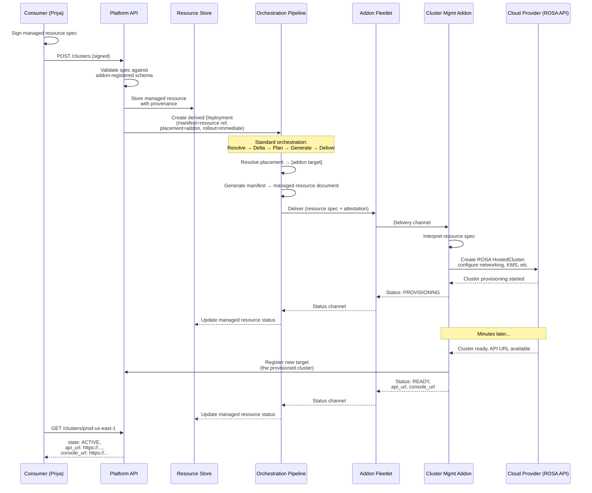

# Managed resources

> **Naming note.** This document uses "managed resource" as the working term for addon-driven, consumer-facing resource types. Alternative names worth revisiting as the design matures: **offering** (captures the provider/consumer relationship with zero Kubernetes namespace collision), **fulfillment** (emphasizes the lifecycle from intent to realized infrastructure). "Platform resource" was the original term but was retired because "platform" already refers to the management plane itself.

## Problem

How do we offer an extensible core, but allow addons to offer "managed resource" like semantics, that incorporate decade+ of best practices?

Example: imagine a full featured cluster management addon. It should handle many domain specific use cases:

- Provision & configure managed clusters directly targeting managed provider APIs, likely with passthrough auth (e.g. ROSA or ARO clusters)
- Provision & configure clusters through native self managed options (e.g. wrapping openshift assisted installer)
- Provision & configure clusters through operators like CAPI or HyperShift
- Import existing clusters
- Upgrade these clusters (either individually or through a campaign, see https://redhat.atlassian.net/jira/software/c/projects/FM/list?selectedIssue=FM-81 )
- Full exploitation of the core placement and rollout strategy abstractions for progressive delivery, maintenance windows, etc., encoding specific cluster management best practices
- Assist in knowable operational issues in the course of provisioning, upgrades, or other configuration changes
- Manage cluster pooling strategies
- View the state of clusters and their underlying nodes (inventory)
- Integration with other cluster-related addons, like ACS, MCOA, ODF, ...

You could imagine similar domain specific experiences for other managed resource types:

- VMs
- Argo instances
- Model serving
- ...

These are the consumer-facing "nouns" of the platform, in contrast to the addon-facing core abstractions. In some sense, the whole interesting architecture of FleetShift is getting these two competing halves right:

- An agnostic "fleet core" that encodes only the most generic, consistent, "meta" or cross cutting best practices. Things like durability, resilience, extensibility, pooling, fleet-awareness, placement and rollout control, inventory, IAM, metering, ...
- Thoroughly domain specific "nouns" that are opinionated and encode all of the best practice and real world experience we can muster

## Proposal

_Managed resources_ are the "consumer-facing nouns" of the platform. They are addon-driven. Addons register to provide the functions for one or more managed resource types.

Managed resources are driven by the core Deployment abstraction. A managed resource is a _registered resource type_ (as in, a manifest resource type). An addon defines how Deployments are derived from managed resources. In a typical case, a managed resource maps to a single, immediate placement with the addon itself as the target.

> OPEN QUESTION: Can we support other targets than the addon itself? How will those targets verify the attestation? If the only target is the addon itself, then the derived "deployment" is mechanically obvious and can just directly reuse the plumbing without a configurable transformation. If the transformation itself is addon-signed, then we can verify this. But we can defer that for later.

Example: a cluster management addon registers the `clusters` managed resource type. A consumer requests a ROSA cluster. (**These examples illustrate the structural relationships between managed resources, derived deployments, and addon registration — not a specification of the actual API shape. Field names, nesting, and conventions are assumed for readability.**)

#### Consumer-facing managed resource

```json
POST /clusters
{
  "name": "prod-us-east-1",
  "spec": {
    "provider": "rosa",
    "version": "4.16.2",
    "region": "us-east-1",
    "compute_pools": [
      {
        "name": "workers",
        "instance_type": "m5.2xlarge",
        "replicas": 3,
        "autoscaling": { "min_replicas": 3, "max_replicas": 12 }
      }
    ],
    "network": {
      "machine_cidr": "10.0.0.0/16",
      "service_cidr": "172.30.0.0/16",
      "pod_cidr": "10.128.0.0/14"
    },
    "encryption": {
      "etcd_encryption": true,
      "kms_key_arn": "arn:aws:kms:us-east-1:123456789012:key/mrk-abc123"
    }
  }
}
```

The consumer's agent signs this request. The platform validates the spec against the addon-registered schema, stores the resource, and returns it with platform-managed status fields:

```json
{
  "name": "clusters/prod-us-east-1",
  "uid": "a1b2c3d4-e5f6-7890-abcd-ef1234567890",
  "spec": { "..." },
  "state": "PROVISIONING",
  "reconciling": true,
  "status": {
    "conditions": [
      {
        "type": "Provisioning",
        "status": "True",
        "message": "Creating ROSA cluster infrastructure"
      }
    ]
  },
  "create_time": "2026-04-21T14:30:00Z",
  "provenance": {
    "signature": {
      "signer": {
        "subject": "priya@acme.corp",
        "issuer": "https://sso.acme.corp"
      },
      "content_hash": "sha256:9f86d08...",
      "signature_bytes": "MEUCIQ..."
    }
  }
}
```

The `spec` is entirely addon-defined — the platform stores it opaquely but validates it against the addon's registered schema. The `state`, `reconciling`, `status`, `provenance`, and timestamps are platform-managed, following the same patterns as Deployment (AIP-128 declarative-friendly).

#### Derived deployment

The platform mechanically derives a Deployment from the managed resource. Because the addon is the fulfillment target, the derivation is fixed — no configurable transformation:

```json
{
  "name": "deployments/_managed/clusters/prod-us-east-1",
  "manifest_strategy": {
    "type": "MANAGED_RESOURCE",
    "managed_resource": {
      "resource_type": "clusters",
      "resource_name": "clusters/prod-us-east-1"
    }
  },
  "placement_strategy": {
    "type": "STATIC",
    "static": {
      "targets": ["targets/cluster-mgmt-addon"]
    }
  },
  "rollout_strategy": {
    "type": "IMMEDIATE"
  },
  "provenance": {
    "signature": { "..." },
    "managed_resource_ref": "clusters/prod-us-east-1"
  }
}
```

- **Manifest strategy**: `MANAGED_RESOURCE` is a reference to the stored resource spec. When the platform delivers to the addon, it sends the full managed resource document. The addon interprets it — in this case, calling the ROSA API to create a HyperShift-based HostedCluster, configuring networking, setting up the KMS-backed etcd encryption, and registering the resulting cluster as a new target.
- **Placement**: a single static target — the addon's own delivery endpoint. The addon registered this target during capability registration. Since the addon is a delivery agent for its own target type, it receives the managed resource through the standard delivery channel.
- **Rollout**: immediate. A single managed resource means a single target means a single delivery — rollout strategy is degenerate.
- **Provenance**: derived from the original managed resource's signature. A verifier can chain from the deployment's provenance back to the user's signed resource intent. The `managed_resource_ref` links the two, and the derivation rule is mechanically fixed (the addon is always the target), so a verifier can confirm the deployment was correctly derived without trusting the platform.

This derived deployment flows through the standard orchestration pipeline: Resolve → Delta → Plan → Generate → Deliver. The only difference from a user-authored deployment is how it was created (derived from a managed resource rather than directly authored) and how its provenance chains (through the managed resource rather than directly signed).

#### Addon resource type registration

When the cluster management addon connects, it registers its managed resource types as part of capability registration:

```json
{
  "capabilities": [
    {
      "name": "cluster-mgmt",
      "managed_resource_types": [
        {
          "resource_type": "clusters",
          "schema": {
            "format": "JSON_SCHEMA",
            "definition": {
              "type": "object",
              "required": ["provider", "version", "region"],
              "properties": {
                "provider": {
                  "type": "string",
                  "enum": ["rosa", "aro", "hypershift", "assisted-installer"]
                },
                "version": {
                  "type": "string",
                  "pattern": "^4\\.[0-9]+\\.[0-9]+$"
                },
                "region": { "type": "string" },
                "compute_pools": { "..." },
                "network": { "..." },
                "encryption": { "..." }
              }
            }
          },
          "delivery_target": "self",
          "status_projection": {
            "fields": ["state", "conditions", "api_url", "console_url"]
          }
        }
      ]
    }
  ]
}
```

- **`resource_type`**: the API path segment. The platform exposes `POST /clusters`, `GET /clusters/{name}`, etc. using this name.
- **`schema`**: validates consumer input before storage. Rejections happen at the API boundary, not during delivery.
- **`delivery_target: "self"`**: the mechanical derivation rule. The derived deployment always targets this addon. This is the common case — and the only case where the derivation is fixed and the attestation chain is trivial (the addon is trusted by virtue of its registration, and the platform is a courier). The OPEN QUESTION above asks whether we should support other targets; for now, `"self"` is the only option.
- **`status_projection`**: which fields from the addon's status reports are surfaced to the consumer. The addon may track internal details (which management cluster hosts this HCP, how many DNS records were created, provisioning step progress) — only the projected fields appear in the consumer-facing `GET /clusters/{name}` response.

This registration is itself signed by the addon and stored as part of the addon's capability record. A delivery-side verifier uses it as evidence: "the addon claimed ownership of `clusters` resources with `delivery_target: self`, so a deployment derived from a `clusters` resource that targets this addon is consistent with the addon's registration."

### Attestation

Provenance is maintained up to the original managed resource, which is signed by the user agent. Managed resources therefore represent another kind of verifiable input, with optionally an accompanying derived resource input (to compliment raw signed deployments and derived deployments). When verifying provenance, the verifier must know how a managed resource structurally relates to the resulting manifests and placement. Typically, the addon itself is expected to be given the manifests, and is trusted to fulfill the user's request faithfully by design. As a separate process, this should not violate the "zero-trust management" principle that the platform is only a courier.

Additionally, we expect addons to be able to, eventually, produce other platform objects as part of delivery. So, if you post a managed resource, it may trigger several other related resource or deployment creations, as defined by an addon. In this case, attestation is similar to addon-signed manifests. The whole resulting artifact is signed by the addon, with proof up to the user's signature on the managed resource. Note that in this case, there needs to be something we can trust that constrains the resulting artifact within the user's original resource intent. This might be evidence from the latest addon registration configuration. This tells a verifier that someone registered this addon, with this resource ownership or deployment mapping. From there a verifier can mechanically test that the original intent was to a resource owned by this addon, that the addon was an appropriate target based on its configuration (or if thats just how it always works), and that the new manifest and placement are indeed signed by the authorized addon.



The key property: the platform is a courier throughout. It stores the user's signed intent, mechanically derives a deployment, and delivers the resource spec to the addon through the standard pipeline. The addon — a separate process with its own identity — is the only component that interprets the spec and interacts with the cloud provider. Provenance chains from the user's signature through the managed resource to the derived deployment to the delivery attestation, without the platform ever needing to understand what a "ROSA cluster" is.

### State

The schema of a managed resource is defined by the addon. The platform takes care of its storage and retrieval through well-known API patterns:

(something like this, TBD)

- `POST /{resource}`: Persists an intent for the resource and begins reconciliation
- `GET  /{resource}`: Retrieves all stored intents
- `GET  /{resource}/{name}`
- `PUT  /{resource}/{name}`

Inventory is a separate concern. Addons can report inventory. Inventory is the state of things as they are. A single intent may explode into many resources. High level intent may explode into many "lower level" decisions and resulting attributes.

> OPEN QUESTION: Could / should we support managed resources backed by addons with their own state. We know some addons will have their own state (ACS in a relational db, MCOA in prometheus/thanos, ...).

### Placement and groupings

A managed resource's placement is defined by the addon. It generally represents a single managed "thing" and therefore a single placement. But technically we could probably support multiple placements. In which case, rollout strategy becomes relevant.

> NOTE: Currently a Deployment supports a single rollout. I intend to adjust this so it is more MWRS-like: many placement×rollout pairs, where each pair independently replicates to its resolved targets. It's a modest change to the core loop, but makes it more flexible and maps more closely to MWRS.

The design here is incomplete but landing on a first increment that is likely correct: just supporting the managed resource model described here.

Further grouping concepts are likely to be added to the core platform kernel in some shape or form, along these orthogonal axis:

- **Reconciliation**. Does the grouping reconcile against a "group-level" definition or not? That is, is the grouping itself a "Deployment" that reconciles, and what of it reconciles? Sometimes you have a definition of a group that allows edits of the sub-resources but corrects for drift where unintended or newly managed.
- **Targeting.** Does the grouping contain delivery targets which can themselves accept manifests or not?
- **Growing.** Is the grouping able to "grow" by provisioning more like members with little input?

A group of targets is already semi-defined: it's the initial placement pool. There is ongoing design work around making this growable and reconciliable.

As established above, we also expect addons to be able to produce platform artifacts (beyond targets or inventory–for example, Deployments or other managed resources) as a result of delivery.

This leads to the following options we should expect in the future by composing one or both of these:

- Mappings directly to platform groupings (for example, a managed resource that is not a single-placement deployment directly but instead maps to a "growable reconciling pool of targets")
- Addons which produce platform groupings as a result of delivery

These are ultimately quite similar to the end user. They differ in architecture (trust, responsibility boundaries, and order of operations.)

### Addon invalidation

In the deployment architecture, we have invalidation signals. For example, if an addon's manifest strategy changes, it will trigger an invalidation of all deployments it generates manifests for, so it can regenerate them and reconciliation takes over.

This design highlights a missing invalidation signal: when the delivery agent itself has a behavior change. If the delivery would now do something different, all manifests for that target must be redelivered. Managed resource addons are one such case, but any delivery agent technically could have its behavior change.

### Domain specific operations

**WIP / DRAFT**

I think a reasonable path here would be to model these as managed resources / sub resources themselves. They need to be REST-friendly, anyway. The trick is that these could result in associated new platform artifacts, like other managed resources, or Deployments. So an addon could implement a smart transformation from a high level cluster upgrade campaign input to low level deployment-that-updates-resources with rollout strategy.

Non-reconciling fleet-wide operations (e.g. upgrade campaigns, rolling patches) are expected to be a separate top-level platform concept alongside managed resources, with their own lifecycle semantics (immutable, terminal, stoppable) and their own design. They build on the same deployment orchestration but differ in lifecycle: a managed resource reconciles continuously, while a campaign runs to completion. This is a separate design effort.

### Domain specific queries

**WIP / DRAFT**

These could possibly be inventory or addon-directed queries (hand waving a bit over what that is–maybe an extension of the federated query mechanism discussed in [architecture.md](./architecture.md)) that are pre-configured templates? We'd like to define a read projection up front and not have to hit the addon to process this.

### Integration (observability, security, ...)

**WIP / DRAFT**

Addons need to be able to integrate with each other.

### API (gRPC / REST)

**WIP / DRAFT**

Implementing REST extensibility is straightforward. The question is do we want to maintain a gRPC-first design and therefore support gRPC extensions as well?

This would mean extensions would be defined as proto at some level.

There is dynamic dispatch support in gRPC. We'd implement an "unimplemented server" which catches the not explicitly implemented RPCs and dispatches them dynamically.

### Durability

How does this design guarantee that (under failure conditions)...

- no resources are orphaned
- resources eventually reconcile (or explicitly fail)

When an addon [re]connects...

- it has to ask about what work it has left to do
- it has to ensure it's reported the state it knows about. This may require querying for all the things it _should_ know about and updating those.
